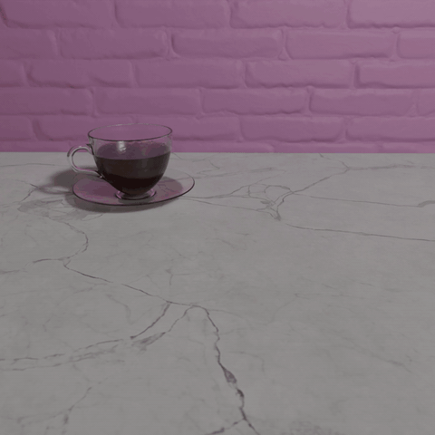

# Ray Tracing Project with Blender

Siyu Zhang                         

Start Time: 2020.10.1

## Introduction

This documentation records the development process of Siyu's Ray Tracing Project with Blender, including weekly progress, references and implementation details in the project.

### Goal of this Project

This  individual Blender project designed for demonstrating the strength ray tracing and customize a set of attributes of [Cycles Engine](https://www.cycles-renderer.org/) in Blender particular for food rendering.

### Technologies and software used in this project

* Blender
  * Version: 2.90
  * Addons:
    * [MACHIN3tools](https://blendermarket.com/products/MACHIN3tools)
    * [Assessment Management](https://gumroad.com/l/asset_management)
    *  [3D Viewport Pie](https://docs.blender.org/manual/en/2.90/addons/interface/viewport_pies.html)
    * [GoB](https://archive.blender.org/wiki/index.php/Extensions:2.6/Py/Scripts/Import-Export/GoB_ZBrush_import_export/)
* Python 3
* ZBrush

## References

### Ray Tracing Algorithms

Ray tracing Algorithms

[https://ocw.mit.edu/courses/electrical-engineering-and-computer-science/6-837-computer-graphics-fall-2012/lecture-notes/MIT6_837F12_Lec13.pdf](https://nam05.safelinks.protection.outlook.com/?url=https%3A%2F%2Focw.mit.edu%2Fcourses%2Felectrical-engineering-and-computer-science%2F6-837-computer-graphics-fall-2012%2Flecture-notes%2FMIT6_837F12_Lec13.pdf&data=02|01|SIZ24%40pitt.edu|22e44fabedc94cd002da08d7d446686e|9ef9f489e0a04eeb87cc3a526112fd0d|1|0|637211271167367533&sdata=28E2TTu1D95hkw%2FuAJlGQsoJ8tyrL6AYMLaB7g1ulHo%3D&reserved=0) 

[https://www.cs.utah.edu/~shirley/books/fcg2/rt.pdf](https://nam05.safelinks.protection.outlook.com/?url=https:%2F%2Fwww.cs.utah.edu%2F~shirley%2Fbooks%2Ffcg2%2Frt.pdf&data=02|01|SIZ24%40pitt.edu|22e44fabedc94cd002da08d7d446686e|9ef9f489e0a04eeb87cc3a526112fd0d|1|0|637211271167367533&sdata=fnPrQLTKoI%2FgElN5LH%2BTSHzRlTexOy8kiJbecommo24%3D&reserved=0) (very long book, just search for basic concepts) 

 

Ray tracing on GPU: 

[http://on-demand.gputechconf.com/gtc-eu/2018/pdf/e8527-real-time-ray-tracing-with-nvidia-rtx.pdf](https://nam05.safelinks.protection.outlook.com/?url=http%3A%2F%2Fon-demand.gputechconf.com%2Fgtc-eu%2F2018%2Fpdf%2Fe8527-real-time-ray-tracing-with-nvidia-rtx.pdf&data=02|01|SIZ24%40pitt.edu|22e44fabedc94cd002da08d7d446686e|9ef9f489e0a04eeb87cc3a526112fd0d|1|0|637211271167367533&sdata=XS5F2TVsdJSei1sTXfxh%2FnaSq0zYcY76HiM3h%2BVNG8A%3D&reserved=0) 

[https://raytracing-docs.nvidia.com/optix6/whitepaper/nvidia_optix_TOG_v29_n4.pdf](https://nam05.safelinks.protection.outlook.com/?url=https%3A%2F%2Fraytracing-docs.nvidia.com%2Foptix6%2Fwhitepaper%2Fnvidia_optix_TOG_v29_n4.pdf&data=02|01|SIZ24%40pitt.edu|22e44fabedc94cd002da08d7d446686e|9ef9f489e0a04eeb87cc3a526112fd0d|1|0|637211271167377493&sdata=q%2Fzdc3Mlw3MHJZaS9mjje%2F28uyKaRcuY3t3o2MIAMeA%3D&reserved=0) 

[https://developer.download.nvidia.com/video/gputechconf/gtc/2019/presentation/s9833-ray-tracing-in-vulkan.pdf](https://nam05.safelinks.protection.outlook.com/?url=https%3A%2F%2Fdeveloper.download.nvidia.com%2Fvideo%2Fgputechconf%2Fgtc%2F2019%2Fpresentation%2Fs9833-ray-tracing-in-vulkan.pdf&data=02|01|SIZ24%40pitt.edu|22e44fabedc94cd002da08d7d446686e|9ef9f489e0a04eeb87cc3a526112fd0d|1|0|637211271167377493&sdata=JVrvTatbbgK89xP3yiDE53qHkNldLgnon9gEL4g89nk%3D&reserved=0) 

 

Peter Shirley – Ray Tracing Book Series 

[Ray Tracing Book Series Github](https://github.com/RayTracing/raytracing.github.io/) 

[Ray Tracing in One Weekend](https://raytracing.github.io/books/RayTracingInOneWeekend.html) 

[Ray Tracing The Next Week](https://raytracing.github.io/books/RayTracingTheNextWeek.html) 

[Ray Tracing The Rest of Your Life](https://raytracing.github.io/books/RayTracingTheRestOfYourLife.html )

### Other Resources

[CUDA programming](https://docs.nvidia.com/cuda/cuda-c-programming-guide/index.html) 

[Blender 2.90.1 Python API Documentation](https://docs.blender.org/api/current/index.html)

## Weekly Progress

### Week 1 (10/1/2020 - 10/8/2020)

#### Plan for the project

* Topic: Ray Tracing 
* Software and Programming Languages:
  * Blender 2.83
  * Python

* Build a scene which is suitable for showing ray tracing property
  * Different kinds of food would be a possible candidate for this
* Possible areas that are need to be learned 
  * Shaders in Blender 
  * rendering pipeline (cycles)
  * OSL (Open Shading Language)

#### Blender learning progress

* Finished Donut project by Blender Guru on YouTube

  Final Rendered Scene

  

  GIF animation:
  
  

### Week 2 (10/9/2020 - 10/14/2020)

#### Update: Plan for the project

* Topic: Ray Tracing 
  * Still related to ray tracing but not really GPU ray tracer
  * **Cycles** in Blender is a quite powerful path tracer renderer
  * Understand Ray Tracing algorithms and Cycles engine implementation
  * Customize Ray Tracing particularly for food models

* Build a scene which is suitable for showing ray tracing property
  * San Miguel Scene – discard this plan
    * Too complicated – time consuming for rendering 
  * Besides donuts, other models of food should be added
    * Plan to modeling the grilled fish in a iron plate

#### Ray Tracing Strength and Choice of Models/Scenes

* Photo-realistic
* Material and Texture representations:
  * Liquid: requires plenty of transmission and reflection lighting rays to look more realistic
    * Soup in the plate of grilled fish
    * boiled soup -- fluid dynamics
  * Glossy metal:
    * The plate of the grilled fish
* Reference

.jpg)

#### Takeaways for this week

* Blender Add-on scripting (Python)
* Built a small add-on tool for recording operation histories and auto-save UVs

#### Plan for the next week

* Start modeling the scene
  * [Finished / In progress] Donuts and Coffee (probably need to change the beverage later - coke would be better?)
  * [In progress] Grilled Fish modeling

### Week 3 (10/15/2020 - 10/22/2020)

### Week 4 (10/23/2020 - 10/29/2020)

### Week 5 (10/30/2020 - 11/5/2020)

### Week 6 (11/6/2020 - 11/12/2020)

## Python Scripting in Blender

This section records notes of Python scripting in Blender, including python blender APIs related to Add-ons.

## Cycles Engine Structure and Path/Ray Tracing Analysis

This sections focuses on analysis of [Cycles Engine source code](https://developer.blender.org/diffusion/B/browse/master/intern/cycles/) which is an open-source and powerful renderer in Blender. [Cycles](https://www.cycles-renderer.org/) is a physically based production renderer developed by the [Blender project](https://www.blender.org/).

[Blender 2.90.1 Python API Documentation](https://docs.blender.org/api/current/index.html)

### bpy

Structure:

* app
* context
* data
* msgbus
* ops  -- integration
* path
* props
* types  -- animation
* utils

