# Ray Tracing Project with Blender

Siyu Zhang                         

Start Time: 2020.10.1

End Time: 2020.11.12


- [Introduction](#introduction)
  * [Goal of this Project](#goal-of-this-project)
  * [Technologies and software used in this project](#technologies-and-software-used-in-this-project)
- [Rasterization VS. Ray Tracing -- Eevee VS. Cycles](#rasterization-vs-ray-tracing----eevee-vs-cycles)
- [References](#references)
  * [Ray Tracing Algorithms](#ray-tracing-algorithms)
  * [Other Resources](#other-resources)
- [Weekly Progress](#weekly-progress)
  * [Week 1 (10/1/2020 - 10/8/2020)](#week-1--10-1-2020---10-8-2020-)
    + [Plan for the project](#plan-for-the-project)
    + [Blender learning progress](#blender-learning-progress)
  * [Week 2 (10/9/2020 - 10/14/2020)](#week-2--10-9-2020---10-14-2020-)
    + [Update: Plan for the project](#update--plan-for-the-project)
    + [Ray Tracing Strength and Choice of Models/Scenes](#ray-tracing-strength-and-choice-of-models-scenes)
    + [Takeaways for this week](#takeaways-for-this-week)
    + [Plan for the next week](#plan-for-the-next-week)
  * [Week 3 (10/15/2020 - 10/22/2020)](#week-3--10-15-2020---10-22-2020-)
    + [Update: Modeling](#update--modeling)
    + [Update: UV and Texture](#update--uv-and-texture)
    + [Takeaways for this week](#takeaways-for-this-week-1)
    + [Plan for the next week](#plan-for-the-next-week-1)
  * [Week 4 (10/23/2020 - 10/31/2020)](#week-4--10-23-2020---10-31-2020-)
    + [Update: UV and Texture](#update--uv-and-texture-1)
    + [Update: Rigid Body & Particle System](#update--rigid-body---particle-system)
    + [Update: Special Effects - Fluid Effect (Smoke & Fire)](#update--special-effects---fluid-effect--smoke---fire-)
    + [Takeaways for this week](#takeaways-for-this-week-2)
    + [Plan for the next week](#plan-for-the-next-week-2)
  * [Week 5 (10/30/2020 - 11/5/2020)](#week-5--10-30-2020---11-5-2020-)
    + [Update: Scene and lighting](#update--scene-and-lighting)
    + [Update: Animation](#update--animation)
    + [Takeaways for this week](#takeaways-for-this-week-3)
    + [Plan for the next week](#plan-for-the-next-week-3)
  * [Week 6 (11/6/2020 - 11/12/2020)](#week-6--11-6-2020---11-12-2020-)
- [Blender Modeling Basics](#blender-modeling-basics)
- [Blender UV Editing Basics](#blender-uv-editing-basics)
- [Blender Lighting](#blender-lighting)
    + [HDRI](#hdri)
    + [Apply PBR Textures in Blender](#apply-pbr-textures-in-blender)
    + [Ambient Occlusion in Eevee Render Engine](#ambient-occlusion-in-eevee-render-engine)
    + [Settings of Eevee Render Engine](#settings-of-eevee-render-engine)
- [Blender Rigid Body](#blender-rigid-body)
- [Blender Particle System](#blender-particle-system)
- [Blender Quick Smoke (Smoke or Fire)](#blender-quick-smoke--smoke-or-fire-)
- [Blender Video Editing](#blender-video-editing)
- [Blender's Directory Layout](#blender-s-directory-layout)
- [Python Scripting in Blender](#python-scripting-in-blender)
  * [bpy](#bpy)
    + [bpy.data](#bpydata)
    + [bpy.context](#bpycontext)
    + [byp.ops](#bypops)
    + [byp.types](#byptypes)
    + [Animation](#animation)
  * [Python API Overview](#python-api-overview)
  * [Reference API Usage](#reference-api-usage)
- [ZBrush Operation Basics](#zbrush-operation-basics)
- [Substance Painter Operation Basics](#substance-painter-operation-basics)
- [Issues / Problems Encountered](#issues---problems-encountered)
  * [[Solved]"C_U-Fish.blend" file takes a while to be started up](#-solved--c-u-fishblend--file-takes-a-while-to-be-started-up)
  * [[Solved]Cannot join objects in the scene](#-solved-cannot-join-objects-in-the-scene)
  * [[Solved]Cannot find checker image in Blender 2.9](#-solved-cannot-find-checker-image-in-blender-29)
  * [[Solved]Cannot using "Shift+1" to merge two points](#-solved-cannot-using--shift-1--to-merge-two-points)
  * [[Solved]Cannot using "I" to insert keyframes](#-solved-cannot-using--i--to-insert-keyframes)
  * [[Solved]How to reset the finished commits without pushing (Git)](#-solved-how-to-reset-the-finished-commits-without-pushing--git-)


## Introduction

This documentation records the development process of Siyu's Blender project "C_U Fish", including findings, weekly progress, references and implementation details in the project.

### Goal of this Project

This individual Blender is designed for illustrating the pros and cons of ray tracing (with [Cycles Engine](https://www.cycles-renderer.org/)), as well as  strengths and weaknesses with rasterization (with [Eevee](https://docs.blender.org/manual/en/latest/render/eevee/index.html)). The main model in this project is a Chinese dish - grilled fish. The processes of modeling, sculpting, UV layout, texturing, lighting and rendering (images and animations) were all finished with **Blender**. Some of the sculpting (the fish) and texturing were assisted and finished in **ZBrush** (for sculpting) and **Substance Painter** (for texturing). 

### Technologies and software used in this project

* Blender
  * Version: 2.90
  * Addons:
    * [MACHIN3tools](https://blendermarket.com/products/MACHIN3tools)
    * [Assessment Management](https://gumroad.com/l/asset_management)
    *  [3D Viewport Pie](https://docs.blender.org/manual/en/2.90/addons/interface/viewport_pies.html)
    * [GoB](https://archive.blender.org/wiki/index.php/Extensions:2.6/Py/Scripts/Import-Export/GoB_ZBrush_import_export/)
  
* Python 3

* ZBrush 2020:

  * powerful in sculpting high-poly models
    * support millions of polys vs. limited support in Blender
      * but Blender sculpting is convenient for making variations of small objects (e.g. the variations of vegetables in this case) 
    * e.g. the fish model contains above 300,000 active points
    * but need to use the Decimation Master Zplugin to reduce points before importing it to Blender
    * otherwise, there would be high latency of operations in Blender
  * provide various kinds of brushes for sculpting
  * grouping and masking functions are quite helpful
  
* Substance Painter:

  * plenty of preset assets (including smart materials, smart masks, brushes, filters, and procedurals)
  * better layers hierarchy or structures
  * easy to import obj files and export different kinds of textures maps (e.g. normal, height, roughness, metallic and base color maps) as needed
  
  

## Rasterization VS. Ray Tracing -- Eevee VS. Cycles 

This sections focuses on analysis of [Cycles Render Engine source code](https://developer.blender.org/diffusion/B/browse/master/intern/cycles/) which is an open-source and powerful renderer in Blender. [Cycles](https://www.cycles-renderer.org/) is a physically based production renderer developed by the [Blender project](https://www.blender.org/).


## References

### Ray Tracing Algorithms

Ray tracing Algorithms

[https://ocw.mit.edu/courses/electrical-engineering-and-computer-science/6-837-computer-graphics-fall-2012/lecture-notes/MIT6_837F12_Lec13.pdf](https://nam05.safelinks.protection.outlook.com/?url=https%3A%2F%2Focw.mit.edu%2Fcourses%2Felectrical-engineering-and-computer-science%2F6-837-computer-graphics-fall-2012%2Flecture-notes%2FMIT6_837F12_Lec13.pdf&data=02|01|SIZ24%40pitt.edu|22e44fabedc94cd002da08d7d446686e|9ef9f489e0a04eeb87cc3a526112fd0d|1|0|637211271167367533&sdata=28E2TTu1D95hkw%2FuAJlGQsoJ8tyrL6AYMLaB7g1ulHo%3D&reserved=0) 

[https://www.cs.utah.edu/~shirley/books/fcg2/rt.pdf](https://nam05.safelinks.protection.outlook.com/?url=https:%2F%2Fwww.cs.utah.edu%2F~shirley%2Fbooks%2Ffcg2%2Frt.pdf&data=02|01|SIZ24%40pitt.edu|22e44fabedc94cd002da08d7d446686e|9ef9f489e0a04eeb87cc3a526112fd0d|1|0|637211271167367533&sdata=fnPrQLTKoI%2FgElN5LH%2BTSHzRlTexOy8kiJbecommo24%3D&reserved=0) (very long book, just search for basic concepts) 

 

Ray tracing on GPU: 

[http://on-demand.gputechconf.com/gtc-eu/2018/pdf/e8527-real-time-ray-tracing-with-nvidia-rtx.pdf](https://nam05.safelinks.protection.outlook.com/?url=http%3A%2F%2Fon-demand.gputechconf.com%2Fgtc-eu%2F2018%2Fpdf%2Fe8527-real-time-ray-tracing-with-nvidia-rtx.pdf&data=02|01|SIZ24%40pitt.edu|22e44fabedc94cd002da08d7d446686e|9ef9f489e0a04eeb87cc3a526112fd0d|1|0|637211271167367533&sdata=XS5F2TVsdJSei1sTXfxh%2FnaSq0zYcY76HiM3h%2BVNG8A%3D&reserved=0) 

[https://raytracing-docs.nvidia.com/optix6/whitepaper/nvidia_optix_TOG_v29_n4.pdf](https://nam05.safelinks.protection.outlook.com/?url=https%3A%2F%2Fraytracing-docs.nvidia.com%2Foptix6%2Fwhitepaper%2Fnvidia_optix_TOG_v29_n4.pdf&data=02|01|SIZ24%40pitt.edu|22e44fabedc94cd002da08d7d446686e|9ef9f489e0a04eeb87cc3a526112fd0d|1|0|637211271167377493&sdata=q%2Fzdc3Mlw3MHJZaS9mjje%2F28uyKaRcuY3t3o2MIAMeA%3D&reserved=0) 

[https://developer.download.nvidia.com/video/gputechconf/gtc/2019/presentation/s9833-ray-tracing-in-vulkan.pdf](https://nam05.safelinks.protection.outlook.com/?url=https%3A%2F%2Fdeveloper.download.nvidia.com%2Fvideo%2Fgputechconf%2Fgtc%2F2019%2Fpresentation%2Fs9833-ray-tracing-in-vulkan.pdf&data=02|01|SIZ24%40pitt.edu|22e44fabedc94cd002da08d7d446686e|9ef9f489e0a04eeb87cc3a526112fd0d|1|0|637211271167377493&sdata=JVrvTatbbgK89xP3yiDE53qHkNldLgnon9gEL4g89nk%3D&reserved=0) 

 

Peter Shirley – Ray Tracing Book Series 

[Ray Tracing Book Series Github](https://github.com/RayTracing/raytracing.github.io/) 

[Ray Tracing in One Weekend](https://raytracing.github.io/books/RayTracingInOneWeekend.html) 

[Ray Tracing The Next Week](https://raytracing.github.io/books/RayTracingTheNextWeek.html) 

[Ray Tracing The Rest of Your Life](https://raytracing.github.io/books/RayTracingTheRestOfYourLife.html )


### Other Resources

[CUDA programming](https://docs.nvidia.com/cuda/cuda-c-programming-guide/index.html) 

[What is HDRI?](https://vrender.com/what-is-hdri/)

[HDRIHaven](https://hdrihaven.com/hdris/)

[Blender's Directory Layout](https://docs.blender.org/manual/en/2.90/advanced/blender_directory_layout.html)

[Blender 2.90.1 Python API Documentation](https://docs.blender.org/api/current/index.html)

[How to Apply PBR Textures in Blender](https://www.texturecan.com/post/1/how-to-apply-pbr-textures-in-blender/)

[Cycle Wiki](https://wiki.blender.org/wiki/Source/Render/Cycles)

[Cut Your Render Time In Half in Blender 2.9](https://www.youtube.com/watch?v=PF8SmNFohco)


## Weekly Progress

### Week 1 (10/1/2020 - 10/8/2020)

#### Plan for the project

* Topic: Ray Tracing 
* Software and Programming Languages:
  * Blender 2.83
  * Python

* Build a scene which is suitable for showing ray tracing property
  * Different kinds of food would be a possible candidate for this
* Possible areas that are need to be learned 
  * Shaders in Blender 
  * rendering pipeline (cycles)
  * OSL (Open Shading Language)

#### Blender learning progress

* Finished Donut project by Blender Guru on YouTube

  Final Rendered Scene

  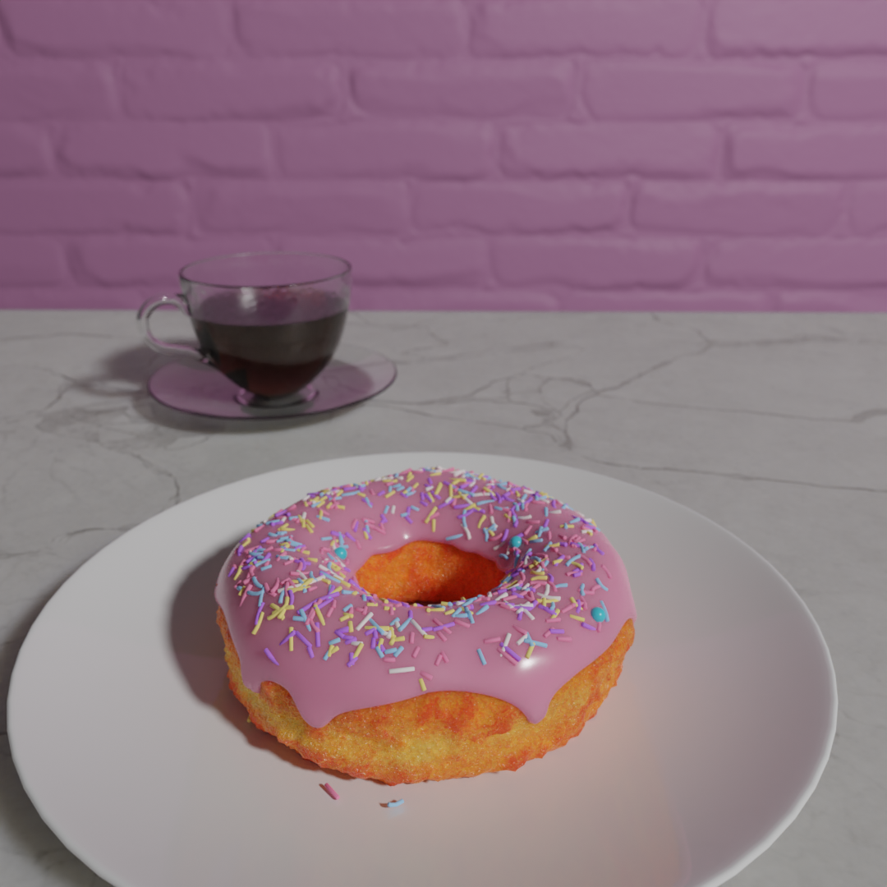

  GIF animation:
  
  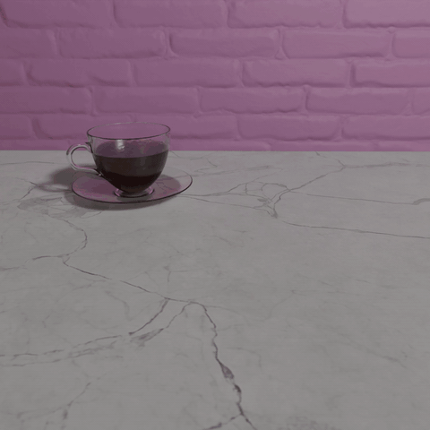


### Week 2 (10/9/2020 - 10/14/2020)

#### Update: Plan for the project

* Topic: Ray Tracing 
  * Still related to ray tracing but not really GPU ray tracer
  * **Cycles** in Blender is a quite powerful path tracer renderer
  * Understand Ray Tracing algorithms and Cycles engine implementation
  * Customize Ray Tracing particularly for food models

* Build a scene which is suitable for showing ray tracing property
  * San Miguel Scene – discard this plan
    * Too complicated – time consuming for rendering 
  * Besides donuts, other models of food should be added
    * Plan to modeling the grilled fish in a iron plate

#### Ray Tracing Strength and Choice of Models/Scenes

* Photo-realistic
* Material and Texture representations:
  * Liquid: requires plenty of transmission and reflection lighting rays to look more realistic
    * Soup in the plate of grilled fish
    * boiled soup -- fluid dynamics
  * Glossy metal:
    * The plate of the grilled fish
* Reference

.jpg)

* Modeling for this week: Finished basic model of the plate

  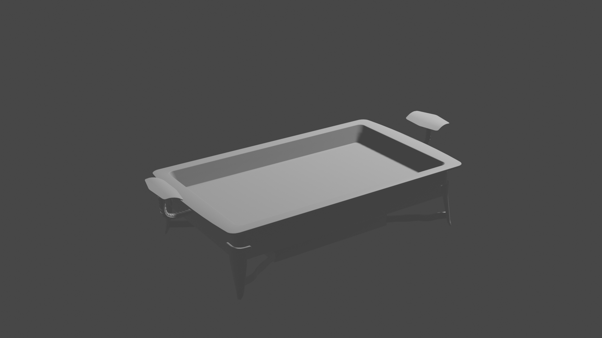

#### Takeaways for this week

* Blender Add-on scripting (Python)
* Built a small add-on tool for recording operation histories and auto-save UVs

#### Plan for the next week

* Start modeling the scene
  * [Finished / In progress] Donuts and Coffee (probably need to change the beverage later - coke would be better?)
  * [In progress] Grilled Fish modeling


### Week 3 (10/15/2020 - 10/22/2020)

#### Update: Modeling

* Finished the modeling of the plate, fish and some vegetables
  * 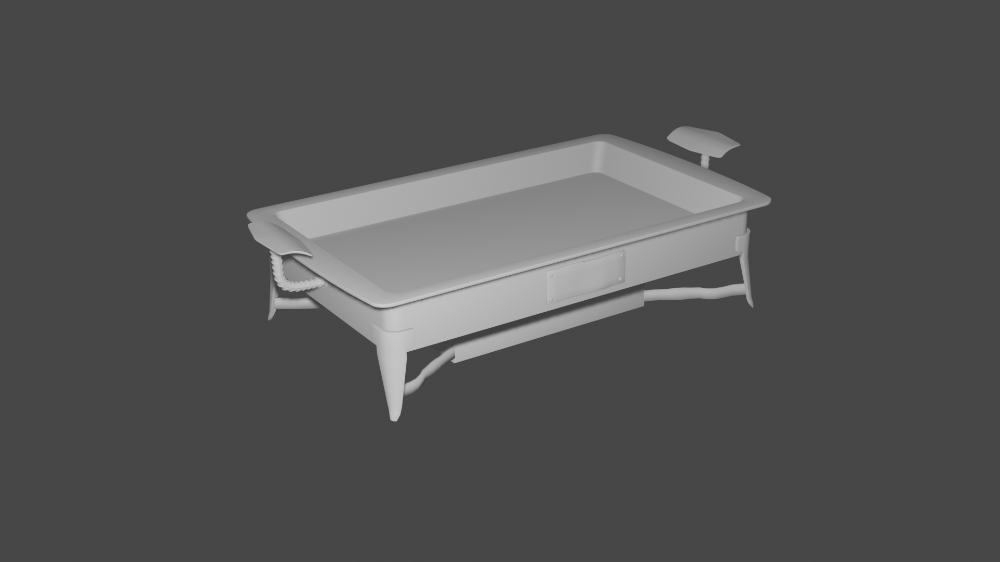
  * 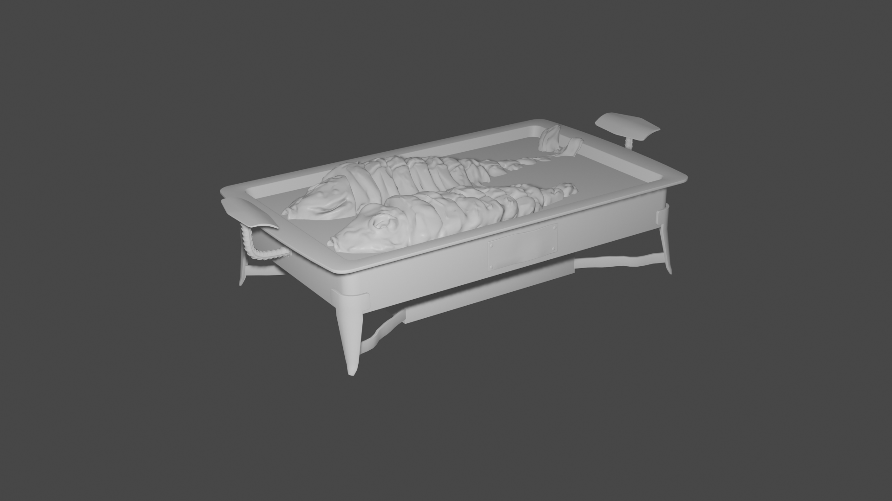
  * 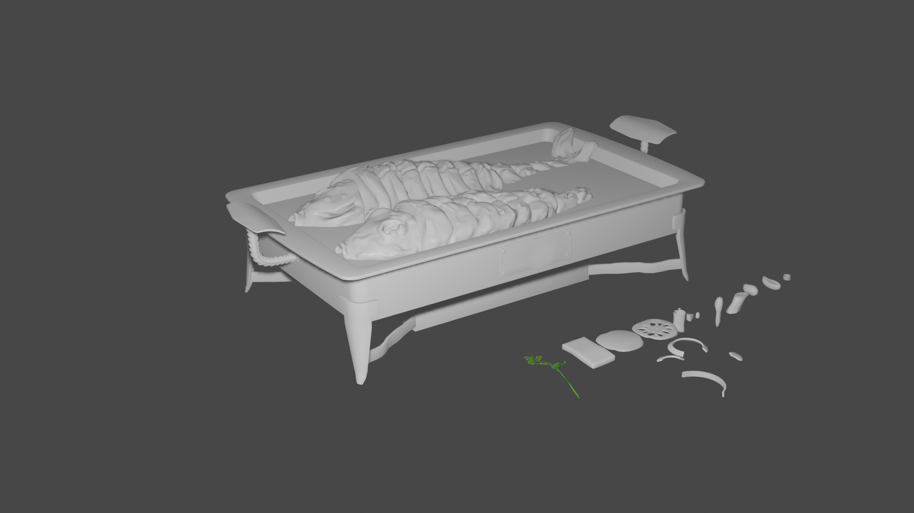
* Sculpting the fish with ZBrush and then imported it into Blender with an add-on
  * 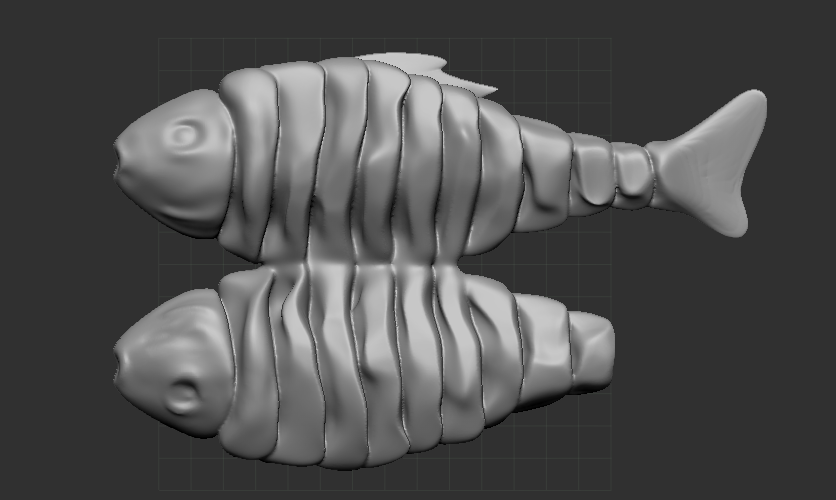
  * 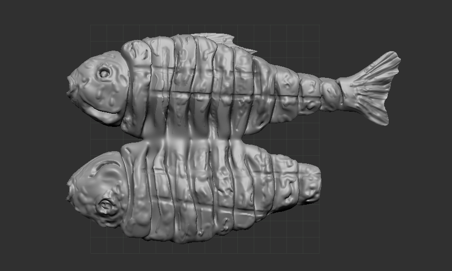
  * 

#### Update: UV and Texture

* Unwrap the UVs of the models for texture painting
  * 
* Using Substance Painter to paint the textures
  * 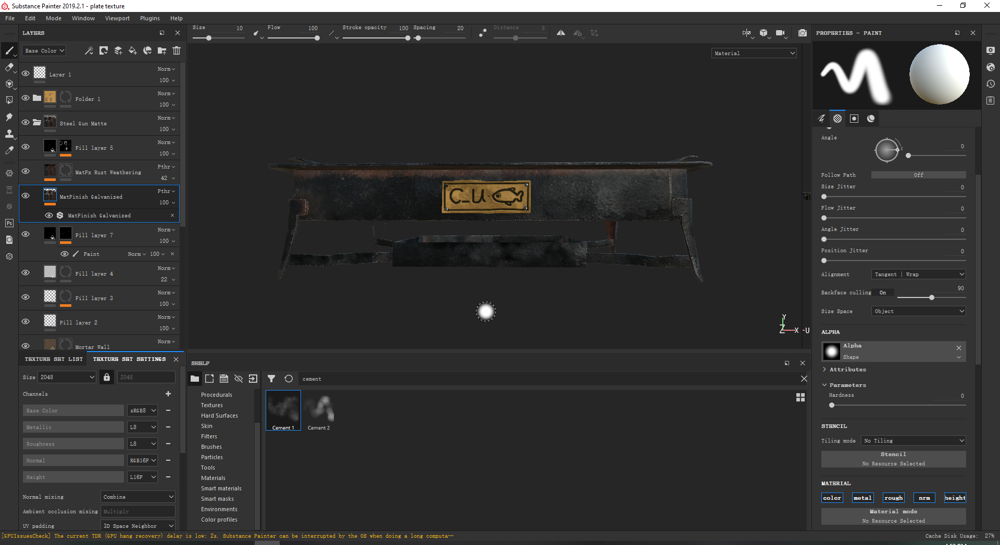
  * 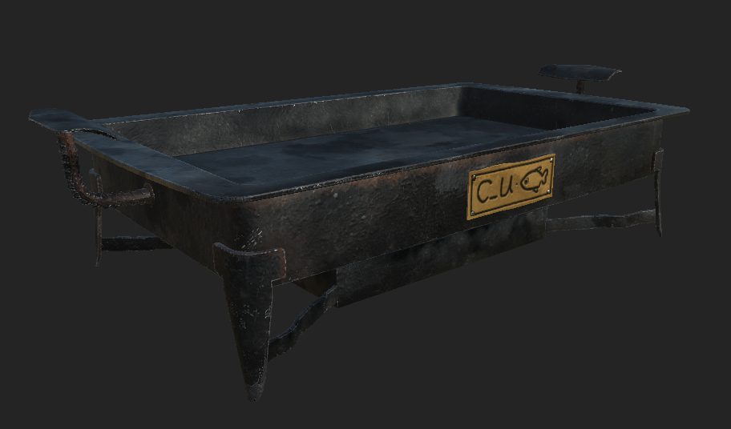
  * 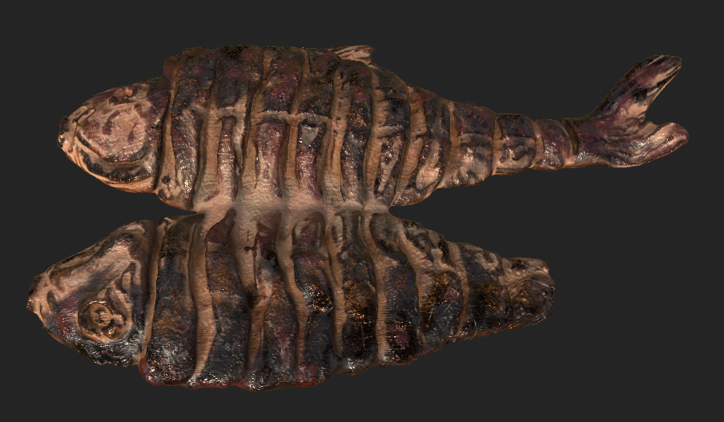

#### Takeaways for this week

* Blender Modeling
* Blender UV Editing
* ZBrush Sculpting
* Substance Painter for textures

#### Plan for the next week

* Finish the textures of the Grilled Fish

* Adjust shading and lighting for creating photo-realistic style

* Spend more time on analyzing Cycles Engine

  

### Week 4 (10/23/2020 - 10/31/2020)

#### Update: UV and Texture

* Finished textures for vegetables
* Added more variations of side vegetables

#### Update: Rigid Body & Particle System

* Added the vegetables to the plate

#### Update: Special Effects - Fluid Effect (Smoke & Fire)

* Created and manipulated the parameters for making better visual effects
  * still need to be improved

#### Takeaways for this week

* Blender shading nodes: Principle PBR node
* Eevee lighting settings vs. Cycles
* Blender Rigid Body for simulation
* Blender Particle System
* Quick Smoke (Smoke and Fire)

#### Plan for the next week

* Cycles lighting 
* Learn and list the necessary parameters for making good lighting 
  
  * probably could integrate them into an Add-on
  
    

### Week 5 (10/30/2020 - 11/5/2020)

#### Update: Scene and lighting

* Removed the kitchen scene but create a studio style scene
  * an "endless" background
* Replaced the HDRI with two lights
  * one above the dish
  * one in front of the dish at a lower place
* 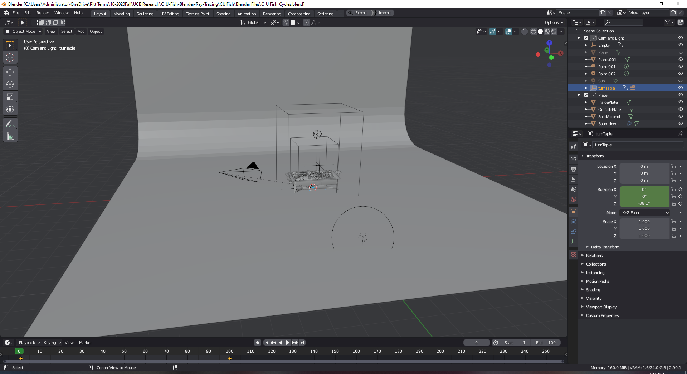

#### Update: Animation

* Rotated the camera with a small angle and made several short animations
  * rendering with Cycles is way slower than Eevee
* Composed the rendered images and made several small animation clips

#### Takeaways for this week

* Blender lighting techniques
* Cycles denoising

#### Plan for the next week

* Focus on analyzing the pros and cons between Cycles and Eevee and broadly ray tracing and rasterization  

### Week 6 (11/6/2020 - 11/12/2020)

* Finish up the report and the final demo video
* Statistics: 
  * 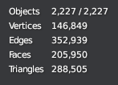


## Blender Modeling Basics

* Start from a plane

* Frequently used:

  * Apply All: Ctrl + A and select Apply All to make the scale and transformation to 1 and 0

  * Bevel: Ctrl + B [before Bevel need to "Apply All"] 

    * offset 
    * percentage

  * Loop Cut and Slide: Ctrl + R

  * Mirror  (Modifier): Ctrl + Alt + X/Y/Z

    * mirror according to origin

  * Extrude: E

    * Vertex -> Edge -> Face

  * Snap:

    * 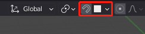
    * Snap to Vertex/Edge/Face
    * Toggle the "Align Rotation to Target" to let it change rotation automatically according to the normal

  * Proportional Editing Objects

    * 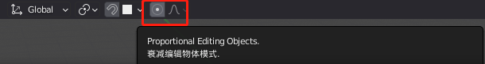

  * Simple Deform (Modifier)

  * Displace (Modifier)

    * creating the texture displace (solid alcohol)

  * Join:

    * Join objects together and make sure they are the same type

  * Triangulate Faces: 

    * Ctrl + T

  * Cut:

    * K
    * with Ctrl stick to Center

  * Shear:
  
    * Ctrl + Shift + Alt + S
  
  * Link Data:
  
    * select the objects that need to change first and then press shift to select the changed object 
    * then ctrl + L to select the data type that want to apply
  
  * Flip (Normal)
  
    * Edit Mode -> Mesh -> Normal -> Flip
  
    

## Blender UV Editing Basics

* Start from top to bottom

* UV Sync Selection

  * 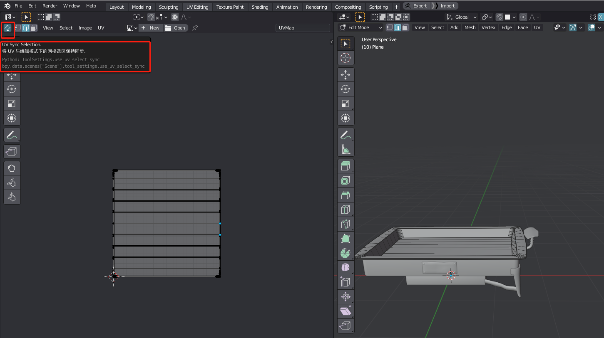

* Projection From Front View

  * 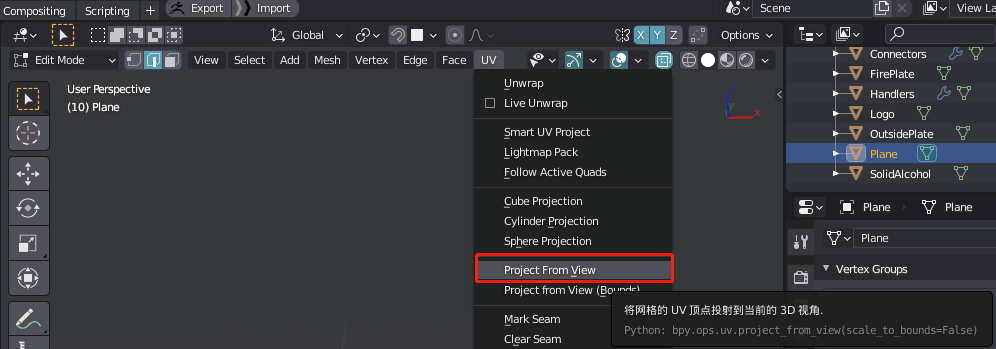

* Mark Seam

  * In UV window, Ctrl + E
  * 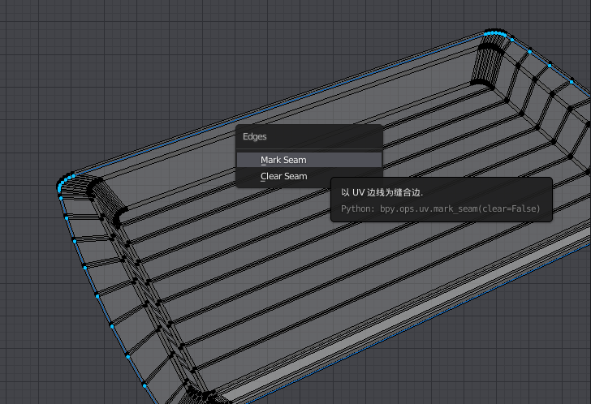

* Select all Vertex / Edge

  * A

* Unwrap

  * U

* For objects with mirror modifier, UV Editing first and then apply them

* UV>Average Island Scale

* UV>Pack Island

  * arrange UVs

* In edge mode, holding Ctrl to select edges. Blender will  automatically calculate the shortest path to connect the two edges you selected. Keep holding Ctrl and selecting edges to figure out the seam you want to have for unwrapping models with complicated topology


## Blender Lighting

#### HDRI

* Definition: HDRI is a panoramic photo, which covers all angles form a single point and contains a large amount of data (usually 32 bits per pixel per channel), which can be used for the illumination of CG scene

* Procedure for setting up HDRI with Assessment Manager Add-on

  * download the HDRI images that you find the most appropriate
    * from e.g. [HDRIHaven](https://hdrihaven.com/hdris/)
  * move the .hdr file to the directory that your Assessment Manager is located for in the project
  * In shading mode, 
    * switch to World shading
    * create the node called "AW_envrionment" and connect the shader with World Output
    * 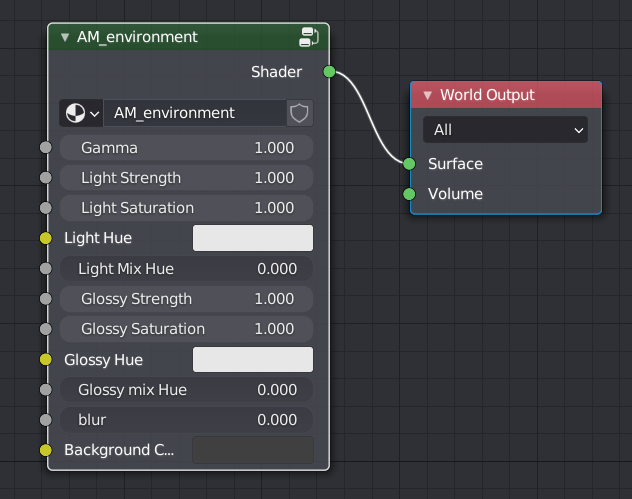

* I chose a fireplace HDRI for having a warm color tone of the scene

  * 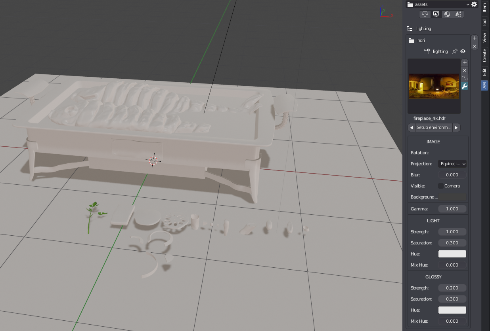

    

#### Apply PBR Textures in Blender

1. UV Unwrap: just like unwrapping a cube before painting each side of it
   * link texture image and 3d models to make a "cloth" for your model
   * in the UV editing of Blender, the two functions are really helpful
     * Average Island Scale (apply this firstly)
     * Pack Island (apply this secondly)
2. Need to have the following maps to find in the PBR shader node

   * Base Color Map

     * Defines colors of textures
     * Shadows and highlights are taken off from the base color map, so it is a purely albedo map.

   * Normal Map

     * Defines the directions each surface is facing
     * It also stores the height or strength of each face, so it can create height variance and affect shadows and highlights.
     * The color space of the Image Texture must be set to "Non-Color Data"

   * Roughness Map

     * Defines how rough a surface is
     * The color space of the Image Texture must be set to "Non-Color Data"

     * To adjust the pre-set roughness:
       * insert a Gamma node between the Image Texture node and the Principled BSDF node
       * If the Gamma value is reduced, the roughness will be increased and vice versa.

   * Metallic Map

     * Defines which parts are metallic and which parts are not
     * Theoretically, materials should either be metallic or non-metallic
     * The color space of the Image Texture must be set to "Non-Color Data"

   * Height Map / Displacement Map

     * Is used to displace the geometry of the mesh
     * Normal map is used to define fine details of the micro-surface and Height maps can cause larger degree of deformation. It usually defines macroscopic levels of displacement
3. In shading mode:
   * click on "Principle BSDF"
   * press "Ctrl+Shift+T" to select the above maps from textures painting (e.g. textures exported from Substance Painter in this case)
     * Make sure you have turned on Use Nodes
       * 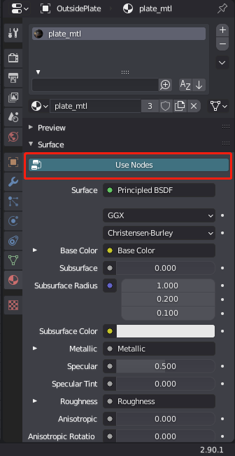
     * it will automatically connect the corresponding parameters and maps for you
       * 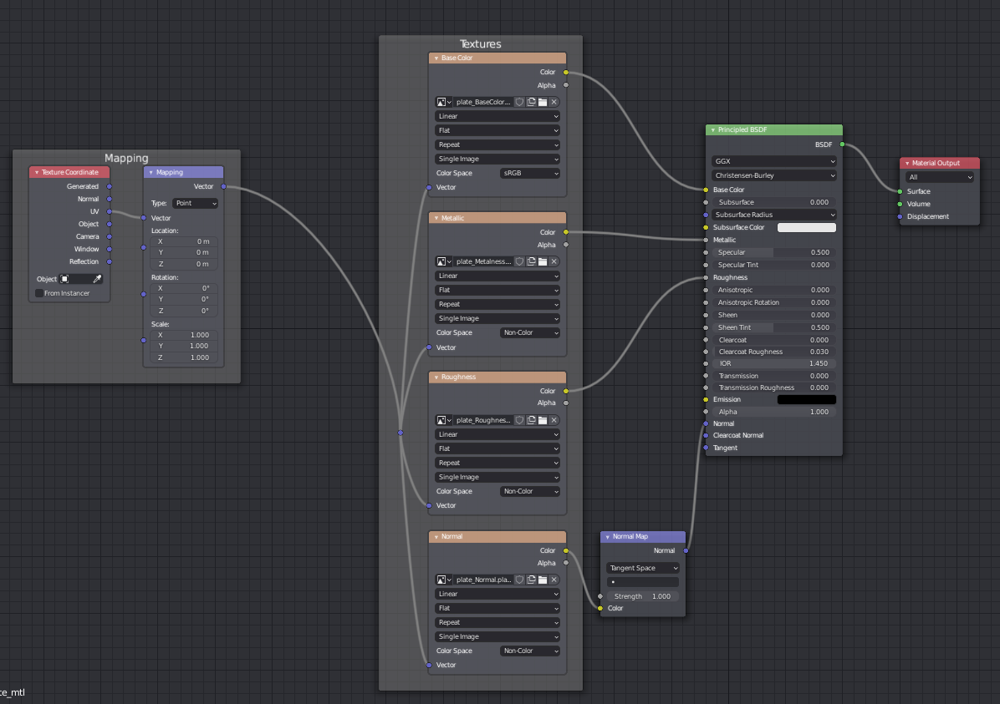
     * Short Cut for applying materials to objects which use a same UV texture
       * set up one of the objects first
       * select all other objects which are in the UV texture
       * press Shift to select the first object and then press "Ctrl+L" to select the "Material"
       * 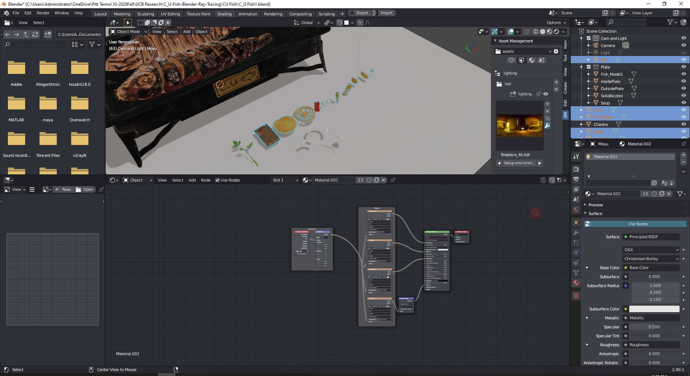


#### Ambient Occlusion in Eevee Render Engine

* Ambient Occlusion: "add more weights"

  * In [3D computer graphics](https://en.wikipedia.org/wiki/3D_computer_graphics), [modeling](https://en.wikipedia.org/wiki/3D_modeling), and [animation](https://en.wikipedia.org/wiki/Computer_animation), **ambient occlusion** is a [shading](https://en.wikipedia.org/wiki/Shading) and [rendering](https://en.wikipedia.org/wiki/Rendering_(computer_graphics)) technique used to calculate how exposed each point in a scene is to [ambient lighting](https://en.wikipedia.org/wiki/Shading#Ambient_lighting). For example, the interior of a tube is typically more occluded (and hence darker) than the exposed outer surfaces, and becomes darker the deeper inside the tube one goes.
  * Ambient occlusion can be seen as an accessibility value that is calculated for each surface point.

* Without AO:

  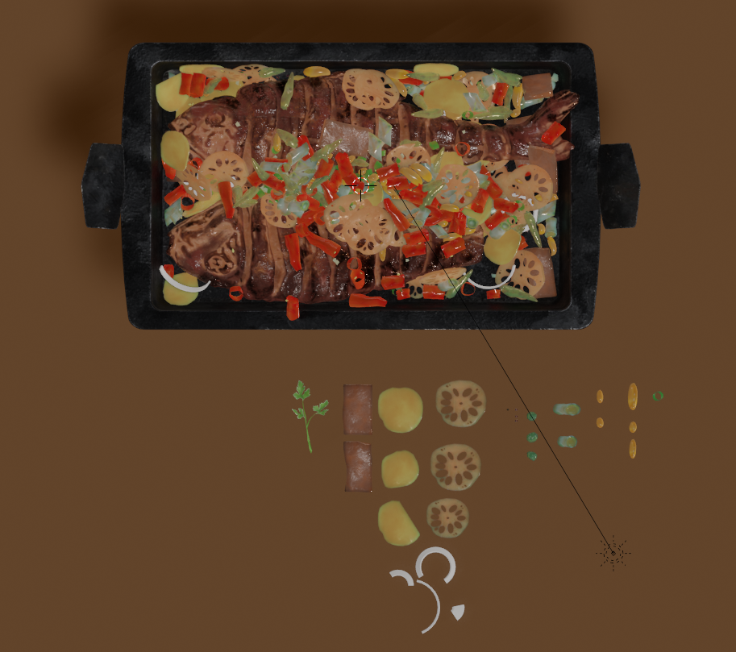
  
* With AO:

  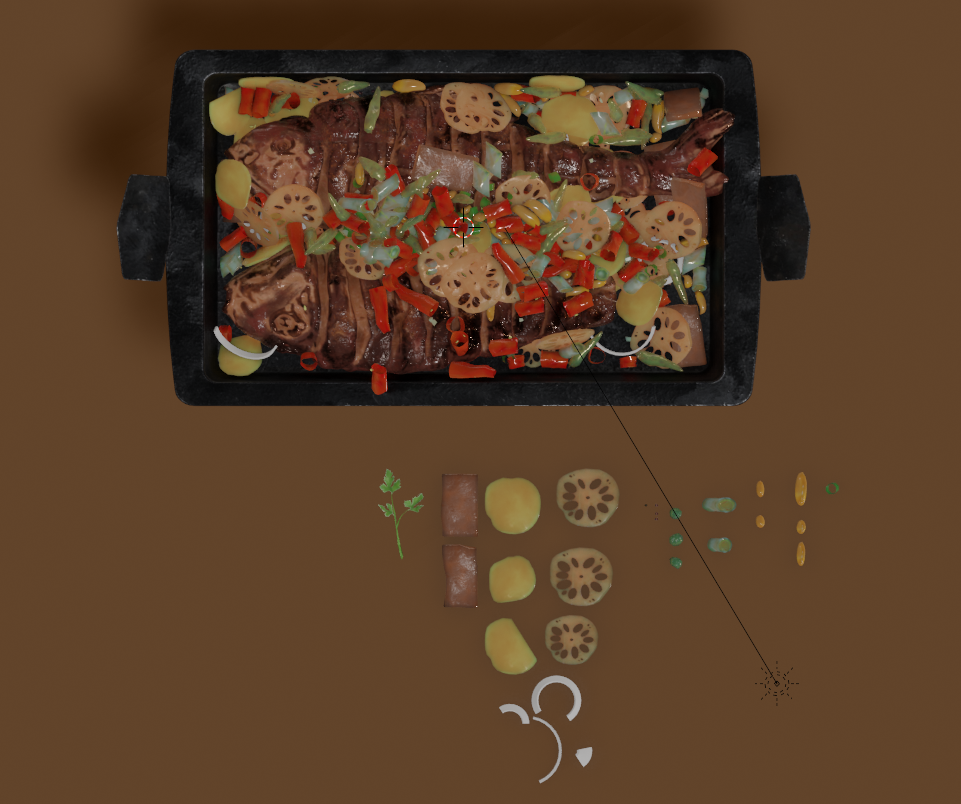

#### Settings of Eevee Render Engine

* Ambient Occlusion

* Bloom

* Screen Space Reflections
  * Refraction
  * Half Res Trace
  
* Set the main lighting (the Sun) to a bit more yellowish and set the strength to 2.0

* Volumetric: 

  * Tile Size: controls the quality of volume effect (lower -> better)
  * Distribution: distribute more samples closer to the camera [can avoid the effect overlay on other objects]
  * 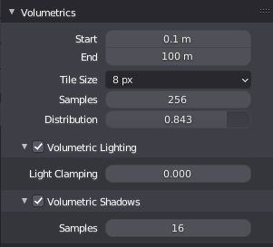

* Camera:

  * in View, under the View Lock, toggle on "Camera To View" to set up camera more easily

  * set Depth of Field and Focus on Object

    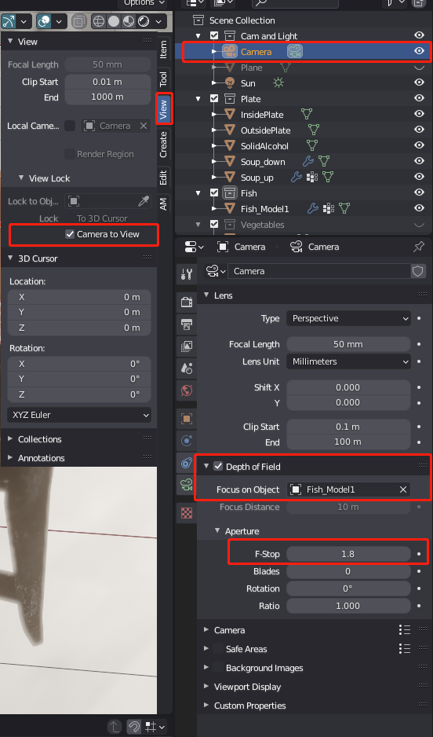

    
  


## Blender Rigid Body

* Used for simulating the randomness when adding main vegetable sides to the plate

* Procedures:

  1. Duplicate all the main vegetable sides multiple times with variations on translations and rotations

  2. Use "Random Transformation" to have a random preset of objects

  3. Select all vegetable and use "Add Active"

     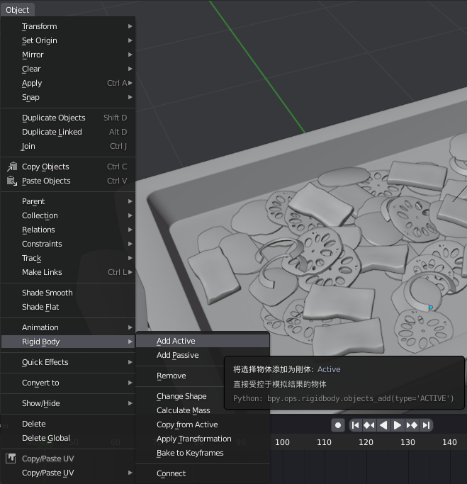

  4. Select the plate and use "Add Passive" and then also set the rigid body Collisions to Mesh

     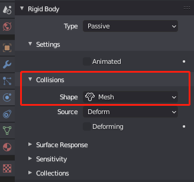

  5. Once figure out an appropriate simulation result, use "Apply Transformation" and then "Remove Rigid Body"

* Examples:

  * Rigid Body used for the lowest layer of vegetables
  * 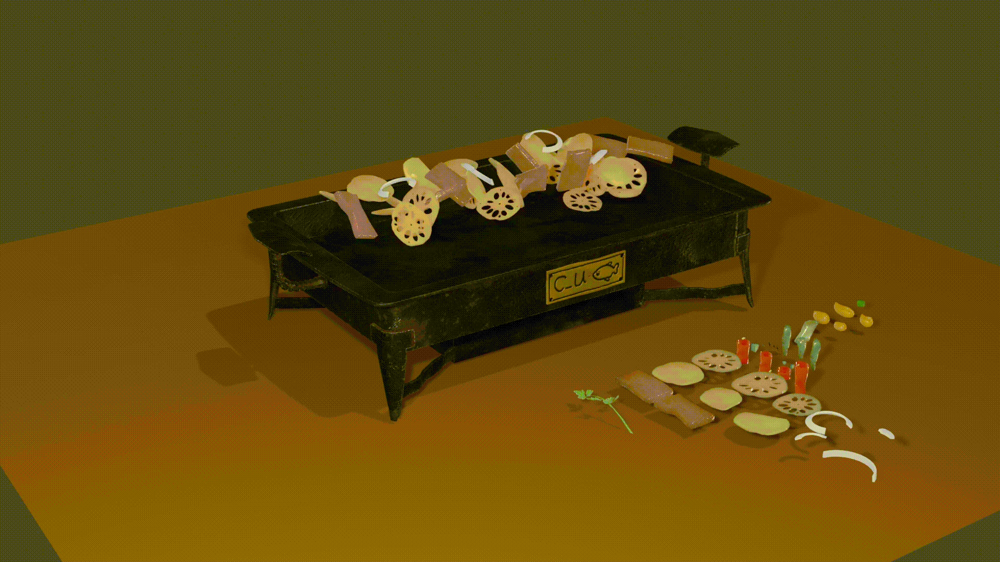
  * Rigid Body used for the upper layer of vegetables
  * 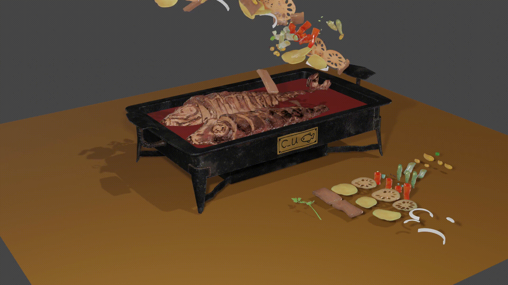

  

## Blender Particle System 

* Used to create random particles 
* Create a new collection for the objects you want to spread out
* adjust parameters in particle system to locate the collection
* switch to "weight paint" mode to draw the area that the particles are allowed to be placed onto
* add some randomness in rotation
* Cannot delete the collection after finishing setting the particle system


## Blender Quick Smoke (Smoke or Fire)

* Workflow

  At least a [Domain](https://docs.blender.org/manual/en/dev/physics/fluid/type/domain/index.html) object and one [Flow](https://docs.blender.org/manual/en/dev/physics/fluid/type/flow.html) object are required to create a fluid simulation.

1. Create a [Domain object](https://docs.blender.org/manual/en/dev/physics/fluid/type/domain/index.html) that defines the bounds of the simulation volume.
2. Set up [Flow](https://docs.blender.org/manual/en/dev/physics/fluid/type/flow.html) objects which will emit fluid.
3. Set up [Effector](https://docs.blender.org/manual/en/dev/physics/fluid/type/effector.html) objects to make the fluid interact with objects in the scene.
4. Assign a [material](https://docs.blender.org/manual/en/dev/physics/fluid/material.html) to the domain object.
5. Save the blend-file.
6. [Bake the Cache](https://docs.blender.org/manual/en/dev/physics/fluid/type/domain/cache.html) for the simulation.

***Have to bake one Quick Smoke first before starting the next one! ! !***

* Smoke:

  * Things you need to create:

    * **Flow objects**: it is like the emitter of the smoke; usually simply mesh objects and find (F3) "Quick Smoke" then select the type as "Smoke" with the behavior of "Inflow"
    * 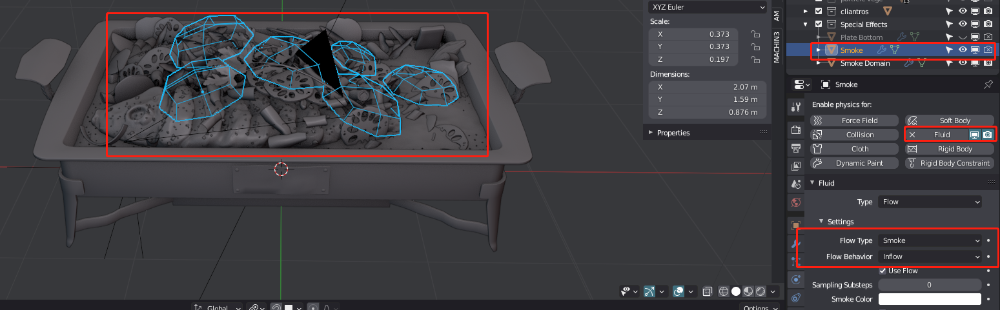
    * **Domain**: after click on "Quick Smoke," a Domain will be automatically generated.
    * 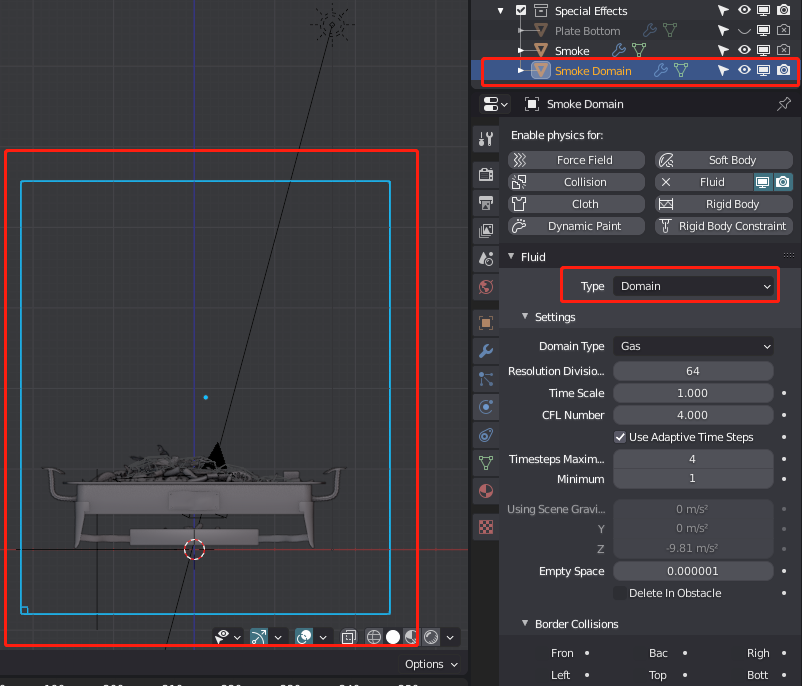

  * Main Attributes to modify:

    In Flow:

    * Smoke Color: modify the color of the smoke
    * Initial Temperature: how fast the smoke is rising
    * Density: the density of the smoke
    * Texture: add more variations to the change of the smoke

    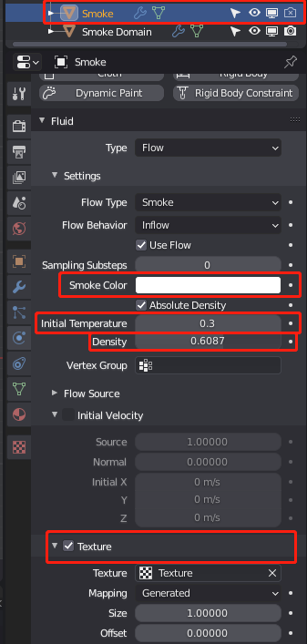

    In Domain:

    * Resolution Division & Time Scale: resolution used for fluid domain and simulation speed
    * Adaptive Domain: add resolution and the domain changes accordingly

    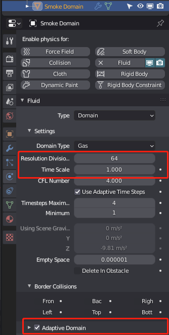

    * Gas:
      * Buoyancy Density: higher -> faster rising smoke
      * Heat: higher -> faster rising smoke
      * Vorticity: turbulence and rotation in smoke
    * Dissolve: how quick the smoke will dissolve (smaller value -> dissolve faster)
    * Noise: used for high-resolution simulation
    * Cache: choose "Type" as "All" and "Bake All" each time the parameters are modified

    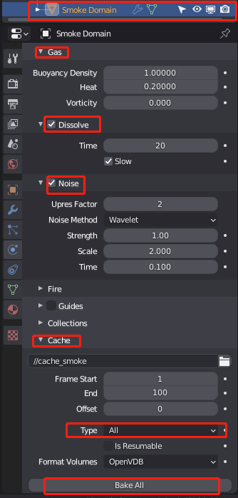


## Blender Video Editing

1. export all frames of the animation to a directory

2. open a new instance of Blender and add a new window called "Video Editing"

   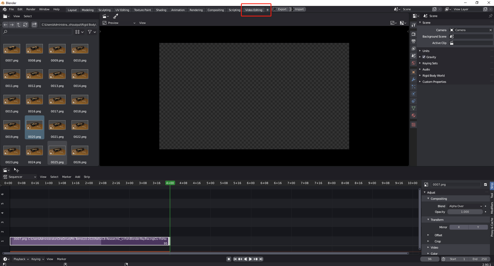

3. Add > images/sequences and select all the exported frames

   i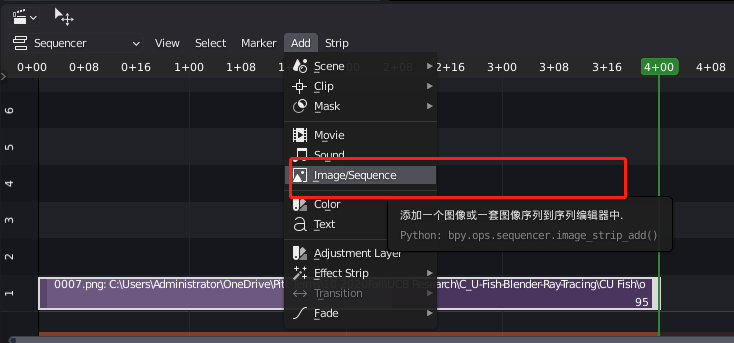

4. Set dimensions correctly as the original frames

   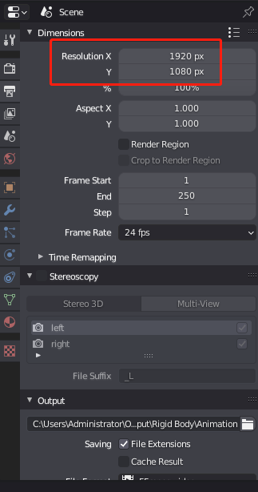

5. Set the following output attributes

   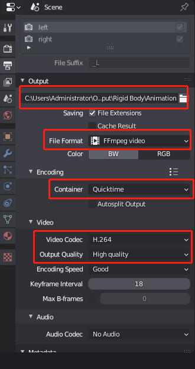

6. Turn off the "Film" View Transform and set to "Standard"

   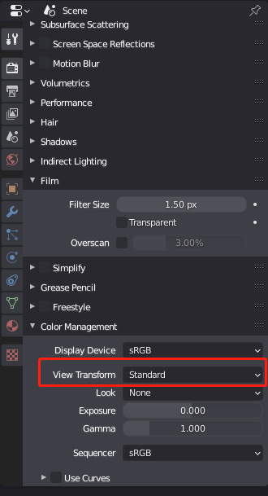

7. Set the frame window the same as your sequence and then press Ctrl+F12 to compose all frames (.mov format output)


## Blender's Directory Layout

[Blender's Directory Layout](https://docs.blender.org/manual/en/2.90/advanced/blender_directory_layout.html)

* /datafiles: foundational codes of Blender: C/C++
* /python: python version 3 (3.7.0)
* /scripts/addons: all downloaded addons locate here
* /scripts/modules: all core API and utility functions for other scripts to import
*  /scripts/presets: scripts that would be executed for all blender projects
* /scripts/templates_py && /scripts/templates_osl: templates for scripting in python and OSL


## Python Scripting in Blender

This section records notes of Python scripting in Blender, including python blender APIs related to Add-ons.

[Blender 2.90.1 Python API Documentation](https://docs.blender.org/api/current/index.html)

### bpy

Structure:

* app
* context
* data 
* msgbus
* ops 
* path
* props
* types 
* utils

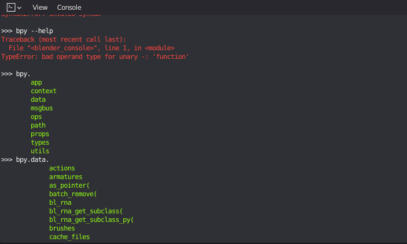


#### bpy.data

* access data blocks
* collections
* access attributes
* data creation/removal
* custom properties

#### bpy.context

* access data directly by name or as a list, it’s more common to operate on the **user’s selection**
* read-only

#### byp.ops

* tools: e.g. delete objects ``bpy.ops.object.delete(use_global=False)``
* inspector: e.g. poll()

#### byp.types

* native types: python
* internal types: Blender structures
* mathutils types: matrix, etc.

#### Animation

1. byp.context.object.keyframes_insert()
2. byp.context.object.animation_data_create()


### Python API Overview

* Python is integrated / embedded in Blender

* Script loading: 

  * usually by importing as a module
  * can be used multiple times by importing
  * extend Blender by registering classes

* run scripts directly in Python:

  * in Blender console
  * run in text editor by pressing **Run Script**
  * ``blender --python /home/me/my_script.py``

* Run as module

  * import ...
  * in text editor and tick "Register" option, will load with blend file
  * add to addons folder
  * add to startup folders

* Add-ons:

  * add-ons must contain a bl_info variable which Blender uses to read metadata such as name, author, category and URL
  * must register and unregister

* integration through classes:

  * allowed integrations for: bpy.types.Panel, Menu, Operator, PropertyGroup, KeyingSet, RenderEngine

  * intentionally limited: advanced features such as mesh modifiers, object types, or shader nodes,

    * C/C++ must be used

  * ``bl_idname``: name can be called in python of Blender

    * ``bl_label``: name shown to users

  * ```python
    import bpy
    class SimpleOperator(bpy.types.Operator):
        bl_idname = "object.simple_operator"
        bl_label = "Tool Name"
    
        def execute(self, context):
            print("Hello World")
            return {'FINISHED'}
    
    bpy.utils.register_class(SimpleOperator)
    
    ```

    * So once the class is registered with Blender, instancing the class and calling the functions is left up to Blender. In fact you **cannot instance these classes from the script** as you would expect with most Python API’s.

* Registration

  * Module Registration (loaded at startup require register and unregister functions)

  * ```python
    import bpy
    
    class SimpleOperator(bpy.types.Operator):
        """ See example above """
    
    def register():
        bpy.utils.register_class(SimpleOperator)
    
    def unregister():
        bpy.utils.unregister_class(SimpleOperator)
    
    if __name__ == "__main__":
        register()  # only for testing
    ```

    * register won’t re-run when a new blend-file is loaded since `__main__` is reserved for direct execution

* Inter-Class Dependencies

  * group your own settings together

  * have to co-exist with other scripts

  * need to define classes

  * custom properties groups are themselves classes which need to be registered

  * ```python
    # Create new property
    # bpy.data.materials[0].my_custom_props.my_float
    import bpy
    
    class MyMaterialProps(bpy.types.PropertyGroup):
        my_float: bpy.props.FloatProperty()
    
    def register():
        bpy.utils.register_class(MyMaterialProps)
        bpy.types.Material.my_custom_props: bpy.props.PointerProperty(type=MyMaterialProps)
    
    def unregister():
        del bpy.types.Material.my_custom_props
        bpy.utils.unregister_class(MyMaterialProps)
    
    if __name__ == "__main__":
        register()
    ```

  * The lower most class needs to be registered first and that `unregister()` is a mirror of `register()`.

  * ```python
    # Create new property group with a sub property
    # bpy.data.materials[0].my_custom_props.sub_group.my_float
    import bpy
    
    class MyMaterialSubProps(bpy.types.PropertyGroup):
        my_float: bpy.props.FloatProperty()
    
    class MyMaterialGroupProps(bpy.types.PropertyGroup):
        sub_group: bpy.props.PointerProperty(type=MyMaterialSubProps)
    
    def register():
        bpy.utils.register_class(MyMaterialSubProps)
        bpy.utils.register_class(MyMaterialGroupProps)
        bpy.types.Material.my_custom_props: bpy.props.PointerProperty(type=MyMaterialGroupProps)
    
    def unregister():
        del bpy.types.Material.my_custom_props
        bpy.utils.unregister_class(MyMaterialGroupProps)
        bpy.utils.unregister_class(MyMaterialSubProps)
    
    if __name__ == "__main__":
        register()
    ```

* Manipulating Classes

  * Properties can be added and removed as Blender runs, normally done on register or unregister but for some special cases it may be useful to **modify types as the script runs**.

    ```python
    # add a new property to an existing type
    bpy.types.Object.my_float: bpy.props.FloatProperty()
    # remove
    del bpy.types.Object.my_float
    ```

    it equivalent to:

    ```python
    class MyPropGroup(bpy.types.PropertyGroup):
        my_float: bpy.props.FloatProperty()
    ```

* **Dynamic**  class definition

  * an external render engines shader definitions could contain the specifier for data

  * could be useful to define them as **types** and remove them on the fly

    ```python
    for i in range(10):
        idname = "object.operator_%d" % i
    
        def func(self, context):
            print("Hello World", self.bl_idname)
            return {'FINISHED'}
    
        opclass = type("DynOp%d" % i,
                       (bpy.types.Operator, ),
                       {"bl_idname": idname, "bl_label": "Test", "execute": func},
                       )
        bpy.utils.register_class(opclass)
    ```

    * `type()` is called to define the class. This is an alternative syntax for class creation in Python, better suited to constructing classes **dynamically**.

  

### Reference API Usage

* interlinking data types which have an auto-generated reference API
*  [`bpy.types`](https://docs.blender.org/api/current/bpy.types.LayerObjects.html#module-bpy.types) stores types accessed via [`bpy.context`](https://docs.blender.org/api/current/bpy.context.html#module-bpy.context)
* ID Data:
  * access from``bpy.data``
  * ``bpy.data`` contains ``bpy.context``, but ``bpy.context`` is more convenient
  * can add object to another blend file by ID data
  * has garbage-collection system
* move mouse over a button and ``ctrl+c`` and then paste it to console in Blender, you will see the functions that this button called if pressed
* show all operators: only reports operators with the REGISTER option enabled
  
  * ``bpy.app.debug_wm=True``
* Use External Tools
  * Run Gimp in batch mode to execute custom scripts for advanced image processing.
  * Write out 3D models to use external mesh manipulation tools and read back in the results.
  * Convert files into recognizable formats before reading.

* quote usage:

  * ' ': 'png'
  * "": "path"

* User Interface Layout

  * layout.row()
  * layout.column()
  * layout.split()

* Script Efficiency

  * Modify list: 

    * ``polygons = [p for p in mesh.polygons if len(p.vertices) != 3] is **FASTER**``

  * Add list items: 

    * ``my_list.extend([a,b,c, ...])``

  * reverse a list: 

    * ``some_reversed_list = solme+list[::-1]``

  * remove list items: 

    * ```python
      pop_index = 5
      
      # swap so the pop_index is last.
      my_list[-1], my_list[pop_index] = my_list[pop_index], my_list[-1]
      
      # remove last item (pop_index)
      my_list.pop()
      ```

  * avoid copying list:

    * This is generally faster since there is no re-assignment and no list duplication:

      ```python
      some_list_func(vec)
      ```

    * passing a sliced list makes a copy of the list in Python memory:

    ```python
    >>> foobar(my_list[:])
    ```

    If my_list was a large array containing 10,000’s of items, a copy could use a lot of extra memory.

  * Value Comparison
    * Python has two ways to compare values `a == b` and `a is b`, the difference is that `==` may run the objects comparison function `__cmp__()` whereas `is` compares identity, this is, that both variables reference the same item in memory.
    * In cases where you know you are checking for the same value which is referenced from multiple places, `is` is faster.

  * Parsing Numbers

    * Use `float(string)` rather than `eval(string)`, if you know the value will be an int then `int(string)`, `float()` will work for an int too but it is faster to read ints with `int()`.

  * Time Your Code

    * While developing a script it is good to time it to be aware of any changes in performance, this can be done simply:

    ```python
    import time
    time_start = time.time()
    
    # do something...
    
    print("My Script Finished: %.4f sec" % (time.time() - time_start))
    ```


## ZBrush Operation Basics

* Rotation: Left Click
* View Lock: Shift + Left Click
* Drag View: Alt + Left Click/Right Click
* Zoom In/Out: Ctrl + Right Click
* Size of brush: S
* Rotation/Scale/Translate: W
* Back to Brush: Q
* Set brush keymap:  Ctrl + Alt and click on the brush then type the keys
  * Move: 1
  * Move Topology: 2
  * Standard: 3
  * ClayBuildUp: 4
  * hPolish: 5
  * Trim Curve: Ctrl + Shift
  * Mask: Ctrl + Left Click Select
* Draw PolyFrame: Shift + F
* Auto Groups: Polygroups>Auto Groups
* Select different group: Under W mode, press Ctrl and then left click
* Reset Mesh Orientation: Under W mode, Alt and click reset button
* Duplicate: Subtool > Dupilicate
* DynaMesh: Geometry > DynaMesh
* Decimation Master: Zplugin > Decimation Master


## Substance Painter Operation Basics

* Rotation: 
  * view: Alt + Left Click
  * light: Shift + Right Click
* Translation: Alt + Middle Click
* Scale: Alt + Right Click
* Process of making materials:
  * export as obj from blender
  * import the obj to SP
  * rename the texture
  * textures set settings > Bake Mesh Maps > 4096
  * find similar material from preset materials


## Issues / Problems Encountered

### [Solved]"C_U-Fish.blend" file takes a while to be started up

* Reason: looks like you have a bad addon ([Assessment Management](https://gumroad.com/l/asset_management) is not really compatible with 2.90 version)
* Solution: disable [Assessment Management](https://gumroad.com/l/asset_management) and try again

### [Solved]Cannot join objects in the scene

* Reason: the selected objects did not have the same type (one with a modifier and others didn't)
* Solution: delete the object and duplicate another object to finish the join

### [Solved]Cannot find checker image in Blender 2.9

* Reason: in UV Editing, there is no checker image to be used
* Solution: in Shading mode, there is a node called "checker node" which has the same function

### [Solved]Cannot using "Shift+1" to merge two points

* Reason: it doesn't work when I selected two objects
* Solution: use Join (ctrl + j) to make them the same object and then using Shift+1

### [Solved]Cannot using "I" to insert keyframes

* Reason: there was an error "Keying set failed to insert any keyframes" when I pressed "I"
* Solution: find keyframe sets and clear all keyframe sets

### [Solved]How to reset the finished commits without pushing (Git) 

* Solution: 
  * Do NOT use `git reset --hard`
  * Do NOT use `git reset --hard`
  * Do NOT use `git reset --hard`
  * Use `git reset HEAD^` to get back to the last commit without deleting all your local files in the unpushed commit

​                                                                                                                                      