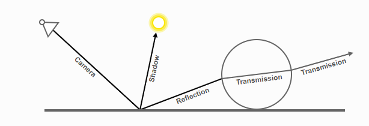
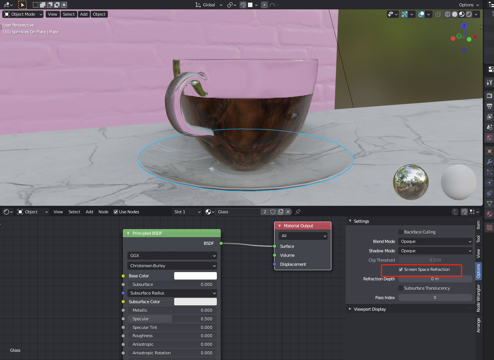

# C_U-Fish-Blender
## Introduction

This repo contains all of the files for my individual Blender project designed for illustrating the pros and cons of ray tracing (with [Cycles Engine](https://www.cycles-renderer.org/)), as well as  strengths and weaknesses with rasterization (with [Eevee](https://docs.blender.org/manual/en/latest/render/eevee/index.html)). The main model in this project is a Chinese dish - grilled fish. The processes of modeling, sculpting, UV layout, texturing, lighting and rendering (images and animations) were all finished with **Blender**. Some of the sculpting (the fish) and texturing were assisted and finished in **ZBrush** (for sculpting) and **Substance Painter** (for texturing). 


** Detailed development logs are recorded in [Project Logs](https://github.com/CU2018/C_U-Fish-Blender-Ray-Tracing/blob/master/Project%20Documents/Project%20Logs.md) under the folder named "[Project Documentation](https://github.com/CU2018/C_U-Fish-Blender-Ray-Tracing/tree/master/Project%20Documents)"


## Hardware & Software

GPU: RTX 3090

Software: 

* Blender
  * Version: 2.90
  * Addons:
    * [MACHIN3tools](https://blendermarket.com/products/MACHIN3tools)
    * [Assessment Management](https://gumroad.com/l/asset_management)
    * [3D Viewport Pie](https://docs.blender.org/manual/en/2.90/addons/interface/viewport_pies.html)
    * [GoB](https://archive.blender.org/wiki/index.php/Extensions:2.6/Py/Scripts/Import-Export/GoB_ZBrush_import_export/)
* ZBrush 2020

  * powerful in sculpting high-poly models
    * support millions of polys vs. limited support in Blender
      * but Blender sculpting is convenient for making variations of small objects (e.g. the variations of vegetables in this case) 
    * e.g. the fish model contains above 300,000 active points
    * but need to use the Decimation Master Zplugin to reduce points before importing it to Blender
    * otherwise, there would be high latency of operations in Blender
  * provide various kinds of brushes for sculpting
  * grouping and masking function are quite helpful

* Substance Painter:

  * plenty of preset assets (including smart materials, smart masks, brushes, filters, and procedurals)
  * better layers hierarchy or structures
  * easy to import obj files and export different kinds of textures maps (e.g. normal, height, roughness, metallic and base color maps) as needed


## Report: Rasterization VS. Ray Tracing -- Eevee VS. Cycles in Blender

In this project,  the main object in the scene -- "C_U Fish" was finished firstly by modeling, sculpting, UV unwrapping, texturing, lighting and rendering (images and animations)  with **Blender** (mainly), **ZBrush** (for sculpting), **Substance Painter** (for texturing). In terms of rendering, it was planned to be done with Cycles in the final scene because it was assumed to have a better render result since Cycles is a path tracer based on physics. And throughout the procession of producing the main object, Eevee rendering engine was used to preview the result with a faster or even immediate rendering time. Besides the elaborated and fine textures of the fish, the vegetables, and the plate, two fluid effects should be paid attention to, including the steam (made by Quick Smoke in Blender) over the dish and the fire (made by Quick Smoke in Blender) under the plate. It is surprising to find out that the final rendered images by Eevee seem to be subjectively better than that by Cycles. This finding causes the following comparisons and discussion between the two rendering methods -- Rasterization and Ray Tracing.

### Rasterization - Eevee 

Rasterization is a traditional way of rendering 3D models in Computer Graphics and it is popular due to its immediacy or the property of realtime. However, rasterization also introduces problem when computing the mapping from scene geometry to pixels and it does not prescribe a particular way to compute the color of those pixels.

According to Blender documentation, Eevee engine is a realtime render engine built using OpenGL and aims to focus on speed and interactivity while also achieving the goal of rendering PBR (Physical Based Rendering) materials.

Here is a diagram which demonstrates the pipeline of OpenGL rendering:


​								                                                                               [Rendering Pipeline Overview](https://www.khronos.org/opengl/wiki/Rendering_Pipeline_Overview)

Due to the pipeline, rasterization has the following primary logic:

```
Rasterization loop:
	For each object
		For each pixel - closer? (Z-buffering; visibility/occlusion)
```


### Ray Tracing - Cycles

Ray tracing is an increasingly popular rendering technique which traces the path of light as pixels in an image plane and simulates the effects of its encounters with virtual objects. People are using this technique more frequently because it is capable of producing more visually realistic images but the cost is long rendering time.

According to Blender documentation, Cycles is a physically-based path tracer for production rendering which is expected to be more physically correct compared with Eevee. Meanwhile, in order to accelerate of computing rays of light, GPU computing is supported. 

The rays in path tracing only produce a single ray per bounce. That's why there's the "Bounce" parameter in the settings of Cycles. The rays do not follow a set line per bounce, but rather shoot off in a random direction which causes noises. So, we have to denoise after rendering by Cycles. Fortunately, in Blender 2.9, we have an AI denoiser based on the  [OptiX](https://docs.blender.org/manual/en/latest/render/cycles/gpu_rendering.html#render-cycles-gpu-optix) acceleration engine and this makes the denoising process faster. The path tracing algorithm then takes a random sampling of all of the rays to create the final image. This results in sampling a variety of different types of lighting, but especially global illumination.

An interesting thing about path tracing is that the effect can be emulated through the use of shaders. In Blender, the shader could be the node named "Principle BRDF.

Here is a diagram which demonstrates the pipeline of ray tracing:


​                                                                                   					[DX12 Raytracing tutorial - Part 2](https://developer.nvidia.com/rtx/raytracing/dxr/DX12-Raytracing-tutorial-Part-2)

Due to the pipeline, ray tracing has the following primary logic:

```
Ray Tracing loop:
	For each pixel
		For each object - closest?
```

In the implementation of Cycles, light rays are traced from the camera into the scene and then onto lights (which is the opposite of the reality)




### Outputs

Clip1: 100 frames --> 160-frame animation

* Eevee

  

* Cycles

  

Clip2: 100 frames --> 160-frame animation

* Eevee

  

* Cycles

  

Clip3: 70 frames --> 95-frame animation

* Eevee

  

* Cycles

  

  

### Compare and Analyze Outputs

* Similarity / Premise of the comparison: 

  * Eevee materials are created using the same shader nodes as Cycles, making it easy to render existing scenes. For Cycles users, this property makes Eevee work grate for previewing materials in real-time.

* Differences in render results:
  * Subsurface

  * Volumetric object/effect

  * Texture

  * Lighting 

  * Ambient Occlusion

  * Option>Subsurface Reflection>

  * 

  * *class*`bpy.types.``Material`(*ID*)

    Material data-block to define the appearance of geometric objects for rendering

  * ```
    use_screen_refraction
    ```

    Use raytraced screen space refractions

    - Type: boolean, default False

  * Screen Space Refraction

    - Only one refraction event is correctly modeled.
    - Only opaque and alpha hashed materials can be refracted.

* Differences in render time:

  |        | Clip1 (100 frames) | Clip2 (100 frames) | Clip3 (70 frames) |
  | ------ | ------------------ | ------------------ | ----------------- |
  | Eevee  | 18min 23s          | 16min 43s          | 9min 20s          |
  | Cycles | 7h 14min           | 6h 30min           | 4h 15min          |

  

### Conclusion


### References

[Blender 2.90 Reference Manual](https://docs.blender.org/manual/en/latest/index.html)

[Rendering Pipeline Overview](https://www.khronos.org/opengl/wiki/Rendering_Pipeline_Overview)

[DX12 Raytracing tutorial - Part 2](https://developer.nvidia.com/rtx/raytracing/dxr/DX12-Raytracing-tutorial-Part-2)


