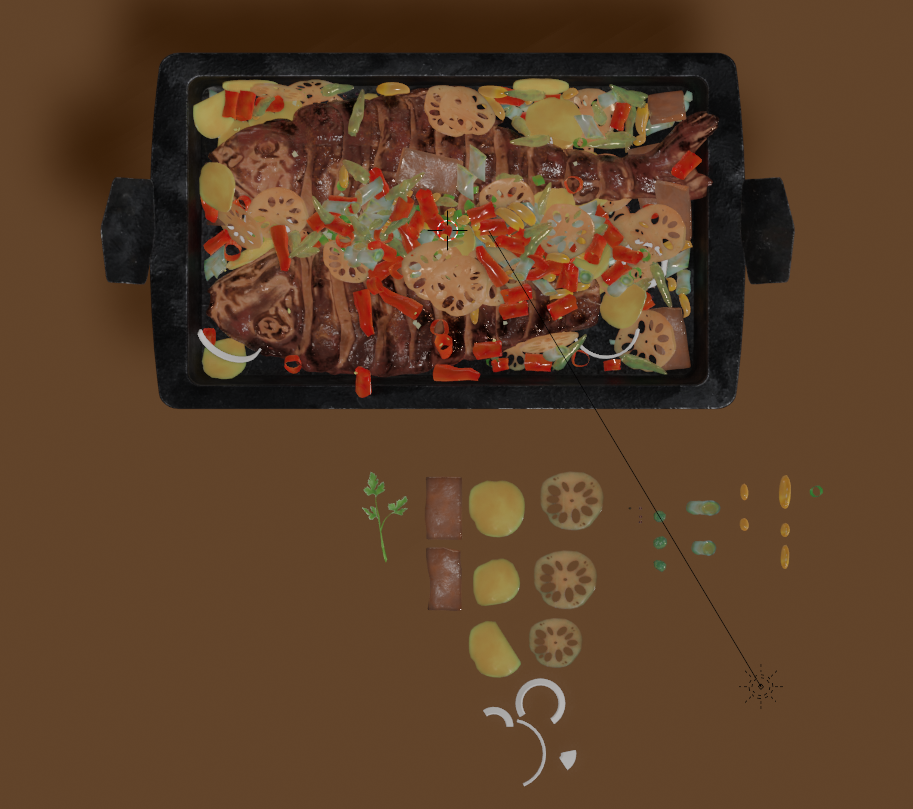

# C_U-Fish-Blender
## Introduction

This repo contains all of the files for my individual Blender project designed for illustrating the pros and cons of ray tracing (with [Cycles Engine](https://www.cycles-renderer.org/)), as well as  strengths and weaknesses of rasterization (with [Eevee](https://docs.blender.org/manual/en/latest/render/eevee/index.html)) typically in food rendering. The main model in this project is a Chinese dish - grilled fish. The processes of modeling, sculpting, UV layout, texturing, lighting and rendering (images and animations) were all finished with **Blender**. Some of the sculpting (the fish) and texturing were assisted and finished in **ZBrush** (for sculpting) and **Substance Painter** (for texturing). 


Statistics: 


** Demo Video: 

* [Bilibili](https://www.bilibili.com/video/BV1xf4y1q72F/)
* [YouTube](https://youtu.be/nLs9hbQGOaU) 
* [Vimeo](https://vimeo.com/user107312361/review/477718296/40d1732870)

** Main blender files are under the folder named "[Blender FIles](https://github.com/CU2018/C_U-Fish-Blender/tree/master/CU%20Fish/Blender%20Files)"

** Detailed development logs are recorded in [Project Logs](https://github.com/CU2018/C_U-Fish-Blender-Ray-Tracing/blob/master/Project%20Documents/Project%20Logs.md) under the folder named "[Project_Documentation](https://github.com/CU2018/C_U-Fish-Blender/tree/master/Project_Documents)"

** [Final Presentation Slides](https://1drv.ms/p/s!Aov0m369Nhu-i_EJln7M6PFzZDbJ8w?e=NmI8bF)


## Table of Content

- [Introduction](#introduction)
- [Table of Content](#table-of-content)
- [Hardware & Software](#hardware---software)
- [Report: Rasterization VS. Ray Tracing -- Eevee VS. Cycles in Blender](#report--rasterization-vs-ray-tracing----eevee-vs-cycles-in-blender)
  * [Rasterization - Eevee](#rasterization---eevee)
  * [Ray Tracing - Cycles](#ray-tracing---cycles)
  * [Outputs](#outputs)
    + [Clip1: 100 frames --> 160-frame animation; focal length: 100 mm](#clip1--100-frames-----160-frame-animation--focal-length--100-mm)
    + [Clip2: 100 frames --> 160-frame animation; focal length: 100 mm](#clip2--100-frames-----160-frame-animation--focal-length--100-mm)
    + [Clip3: 70 frames --> 95-frame animation; focal length: 100 mm](#clip3--70-frames-----95-frame-animation--focal-length--100-mm)
    + [Clip4: 30 frames --> 100-frame animation; focal length: 26 mm](#clip4--30-frames-----100-frame-animation--focal-length--26-mm)
  * [Compare and Analyze the Outputs](#compare-and-analyze-the-outputs)
    + [Similarity / Premise of the comparison](#similarity---premise-of-the-comparison)
    + [Differences](#differences)
      - [Lighting](#lighting)
      - [Subsurface](#subsurface)
      - [Volumetric Object/Effect](#volumetric-object-effect)
      - [Ambient Occlusion / Indirect Shadows](#ambient-occlusion---indirect-shadows)
      - [Refraction](#Refraction)
      - [Render time](#render-time)
  * [Conclusion](#conclusion)
  * [References](#references)


## Hardware & Software

GPU: RTX 3090

Software: 

* Blender
  * Version: 2.90
  * Addons:
    * [MACHIN3tools](https://blendermarket.com/products/MACHIN3tools)
    * [Assessment Management](https://gumroad.com/l/asset_management)
    * [GoB](https://archive.blender.org/wiki/index.php/Extensions:2.6/Py/Scripts/Import-Export/GoB_ZBrush_import_export/)
* ZBrush 2020

  * powerful in sculpting high-poly models
    * support millions of polys vs. limited support in Blender
      * but Blender sculpting is convenient for making variations of small objects (e.g. the variations of vegetables in this case) 
    * e.g. the fish model contains above 300,000 active points
    * but need to use the Decimation Master Zplugin to reduce points before importing it to Blender
    * otherwise, there would be high latency of operations in Blender
  * provide various kinds of brushes for sculpting
  * grouping and masking functions are quite helpful

* Substance Painter:

  * plenty of preset assets (including smart materials, smart masks, brushes, filters, and procedurals)
  * better layers hierarchy or structures
  * easy to import obj files and export different kinds of textures maps (e.g. normal, height, roughness, metallic and base color maps) as needed
  * image textures painted in SP is able to directly linked to the corresponding parameters in the "Principled BSDF" shader


## Report: Rasterization VS. Ray Tracing -- Eevee VS. Cycles in Blender

In this project,  the main object in the scene -- "C_U Fish" was finished firstly by modeling, sculpting, UV unwrapping, texturing, lighting and rendering (images and animations)  with **Blender** (mainly), **ZBrush** (for sculpting), **Substance Painter** (for texturing). In terms of rendering, it was planned to be done with Cycles in the final scene because it was assumed to have a better render result since Cycles is a path tracer based on physics. And throughout the procession of producing the main object, Eevee rendering engine was used to preview the result with a faster or even immediate rendering time. Besides the elaborated and fine textures of the fish, the vegetables, and the plate, two fluid effects should be paid attention to, including the steam (made by Quick Smoke in Blender) over the dish and the fire (made by Quick Smoke in Blender) under the plate. It is surprising to find out that the final rendered images by Eevee seem to be subjectively better than that by Cycles. This finding causes the following comparisons and discussion between the two rendering methods -- Rasterization and Ray Tracing.


### Rasterization - Eevee 

Rasterization is a traditional way of rendering 3D models in Computer Graphics and it is popular due to its immediacy or the property of realtime. However, rasterization also introduces problems when computing the mapping from scene geometry to pixels and it does not prescribe a particular way to compute the color of those pixels.

According to Blender documentation, Eevee engine is a realtime render engine built using OpenGL and aims to focus on speed and interactivity while also achieving the goal of rendering PBR (Physical Based Rendering) materials.

Here is a diagram which demonstrates the pipeline of OpenGL rendering:

​                                                                                                    

​								                                                                               [Rendering Pipeline Overview](https://www.khronos.org/opengl/wiki/Rendering_Pipeline_Overview)

Due to the pipeline, rasterization has the following primary logic:

```
Rasterization loop:
	For each object
		For each pixel - closer? (Z-buffering; visibility/occlusion)
```

In this project, the setting in Eevee looks like this:


### Ray Tracing - Cycles

Ray tracing is an increasingly popular rendering technique which traces the path of light as pixels in an image plane and simulates the effects of its encounters with virtual objects. People are using this technique more frequently because it is capable of producing more visually realistic images but the cost is the long rendering time.

According to Blender documentation, Cycles is a physically-based path tracer for production rendering which is expected to be more physically correct compared with Eevee. Meanwhile, in order to accelerate of computing rays of light, GPU computing is supported. 

The rays in path tracing only produce a single ray per bounce. That's why there's the "Bounce" parameter in the settings of Cycles. The rays do not follow a set line per bounce, but rather shoot off in a random direction which causes noises. So, we have to denoise after rendering by Cycles. Fortunately, in Blender 2.9, we have an AI denoiser based on the  [OptiX](https://docs.blender.org/manual/en/latest/render/cycles/gpu_rendering.html#render-cycles-gpu-optix) acceleration engine and this makes the denoising process faster. The path tracing algorithm then takes a random sampling of all of the rays to create the final image. This results in sampling a variety of different types of lighting, but especially global illumination.

An interesting thing about path tracing is that the effect can be emulated through the use of shaders. In Blender, the shader could be the node named "Principled BSDF.

Here is a diagram which demonstrates the pipeline of ray tracing:


​                                                                                   					[DX12 Raytracing tutorial - Part 2](https://developer.nvidia.com/rtx/raytracing/dxr/DX12-Raytracing-tutorial-Part-2)

Due to the pipeline, ray tracing has the following primary logic:

```
Ray Tracing loop:
	For each pixel
		For each object - closest?
```

In the implementation of Cycles, light rays are traced from the camera into the scene and then onto lights (which is the opposite of the reality)


In this project, the setting in Cycles looks like this:


### Outputs

*** Size of all i: 1920x1080

#### Clip1: 100 frames --> 160-frame animation; focal length: 100 mm

* Eevee

  

* Cycles

  

#### Clip2: 100 frames --> 160-frame animation; focal length: 100 mm

* Eevee

  

* Cycles

  

#### Clip3: 70 frames --> 95-frame animation; focal length: 100 mm

* Eevee

  

* Cycles

  


#### Clip4: 30 frames --> 100-frame animation; focal length: 26 mm

* Eevee

  

* Cycles

  

  

### Compare and Analyze the Outputs

#### Similarity / Premise of the comparison

Before analyzing the differences between the two renders, the premise of the comparison should be pointed out. Both renders use the node named "Principled BSDF" which is based on the Disney principled model also known as the "PBR" (Physically Based Rendering) shader. Eevee materials are created using the same shader nodes as Cycles, making it easy to render existing scenes. For Cycles users, this property makes Eevee work great for previewing materials in real-time.


This makes it easy to change the renderer from Eevee to Cycles without changing too many parameters or attributes.


#### Differences 

As it is noticeable in the clips in the "Outputs section" that Eevee and Cycles provide visually different final images and animations. Here are the aspects/attributes/properties that are shown differently in the results of the two renders.


##### Lighting 

Differences in lighting might be the most primary differences between the two renders. While rasterization or Eevee uses various algorithms to "trick" your eyes to achieve the effect of lighting, Cycles traces the sample rays of light for each pixel for resulting in the physically correct lighting. 

Here is the light setting in this project:


In the two frames below, we could see that the background is noticeable and brighter in Cycles, while the yellow background looks quite dark and is almost "ignored" in Eevee.

* last frame in Clip4 rendered by Eevee


* last frame in Clip4 rendered by Cycles


##### Subsurface

This is an attribute in "Principled BRDF" and it is shown differently in Eevee and Cycles. Almost all of the vegetables in the "C_U Fish" contain a subsurface with a different color than the original base color of the object. Here are images of the vegetables in Eevee and Cycles. 

* last frame in Clip2 rendered by Eevee


* last frame in Clip2 rendered by Cycles


The color of the subsurface in Eevee is less noticeable compared with Cycles when the subsurface mixing values are the same. This difference is related to light and path tracer Cycles provides better rendering results in terms of the subsurface. 

To my surprise, the result in Eevee seems to be more realistic to some extent, while the result in Cycles looks like the dish in some artistically stylized scenes. It might be caused by the fact that the textures and shading parts were done with the preview of Eevee instead of Cycles. 


##### Volumetric Object/Effect

*** the two fluid effects in the project are baked and then rendered in the two renders

In "C_U Fish" project, there are two special effects, including the fire under the plate and the steam over the dish. These two effects are both done in the "Quick Smoke" function in Blender which is categorized as fluid simulation. Clip2, Clip3 and Clip4 most obviously show the differences in the volumetric object or effect output by the two renderers. Cycles won in rendering the volumetric objects (steam/smoke and fire in this case) because it traces rays of light and shows physically correct result for such volumetric objects. Cycles automatically estimates this distance based on voxel size in volume objects and smoke simulations. At the same time, Eevee has a lot of limitations in volumetric object rendering. More info is [here](https://docs.blender.org/manual/en/latest/render/eevee/limitations.html#eevee-limitations-volumetrics). 


##### Ambient Occlusion / Indirect Shadows

In 3D computer graphics, modeling, and animation, ambient occlusion is a shading and rendering technique used to calculate how exposed each point in a scene is to ambient lighting. For example, the interior of a tube is typically more occluded (and hence darker) than the exposed outer surfaces, and becomes darker the deeper inside the tube one goes.

Ambient occlusion can be seen as an accessibility value that is calculated for each surface point and it "adds more weights" to the object.

* Without AO in Eevee:

  

* With AO in Eevee:

  

In the AO with Eevee, objects are treated as infinitely thick, producing overshadowing if the *Distance* is really large which would not happen in Cycles. However, this is an expansive process and can slow down render significantly in Cycles.


##### Refraction

This difference is most obvious in another scene "[donuts](https://github.com/CU2018/C_U-Fish-Blender/tree/master/Donut)" in this project. There is a cup of coffee in this scene and the cup is made of glass. 

It is hard for traditional rasterization or Eevee, in this case, to render the material like glass. To handle this kind of material under Eevee render, the "Screen Space Refraction" should be enabled in the settings of the texture. 


When this function is enabled, Blender actually set the variable ``use_screen_refraction`` for this material to true, which would use raytraced screen space refractions. Meanwhile, this would be effective only when (1) one refraction event is correctly modeled and (2) opaque and alpha hashed materials can be refracted. Therefore, it is obvious that Eevee cannot handle the glass material without using ray tracing.

However, even with this variable enabled, the rendering results are quite different and Cycles is better than Eevee in this aspect.

* Eevee


* Cycles


##### Render time

Eevee shows a significant advantage in render time compared with Cycles. Here is the table comparing the render time for all of the clips in the "Output" section. Computing the sample rays for each pixel (128 rays/pixel in this project), rendering the volume domain and denoising in Cycles are time-consuming and correspondingly resource-consuming.

The GPU used in the project is RTX 3090 and it could take more time depending on the GPUs. 

|        | Clip1 (100 frames) | Clip2 (100 frames) | Clip3 (70 frames) | Clip4 (30 frames) | Average  Render Time (time/frame) |
| ------ | ------------------ | ------------------ | ----------------- | ----------------- | --------------------------------- |
| Eevee  | 18min 23s          | 16min 43s          | 9min 20s          | 4min 25s          | 9 s/frame                         |
| Cycles | 7h 14min           | 6h 30min           | 4h 15min          | 2h 27min          | 4.1 min/frame                     |


### Conclusion

Eevee and Cycle, or more generally, rasterizations and ray tracing have their own strengths and weaknesses. It should also be admitted that ray tracing cannot handle all tasks properly at this point, neither does rasterization. In the terms of achieving a physically correct rendering image, Cycles or ray tracing would be a better choice. However, Cycles is so time-consuming, especially when you render the animation for around 4 hours but you notice that you forget to hide an object that you don't want it to be rendered. And, you have to re-render the entire sequence again. Hence, if the scene needs more interactivity or immediacy, Eevee or rasterization is still a good option if the "tricks" are also used.

Nevertheless, this project still contains some minor errors, such as the fact that the textures and shading were set under the preview of Eevee instead of Cycles, special effects were not rendered properly and some of the ways to accelerate Cycles rendering time are not adapted properly. 

In the future, with targeting the pros and cons of Eevee and Cycles, a more convenient and flexible add-on typically for food rendering or even rendering engine which could combine the two techniques (rasterization and ray tracing) could be furtherly developed.


### References

[Blender 2.90 Reference Manual](https://docs.blender.org/manual/en/latest/index.html)

[Rendering Pipeline Overview](https://www.khronos.org/opengl/wiki/Rendering_Pipeline_Overview)

[DX12 Raytracing tutorial - Part 2](https://developer.nvidia.com/rtx/raytracing/dxr/DX12-Raytracing-tutorial-Part-2)


